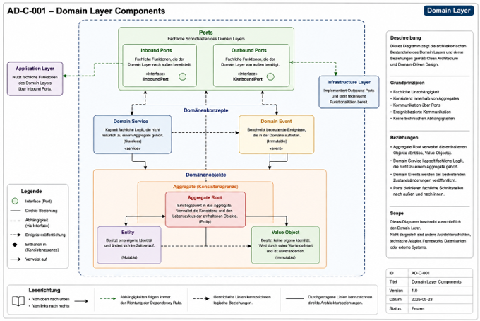

# 07_APPLICATION_ARCHITECTURE.md

# Teil 1 – Zweck und Architekturgrundlagen

## Zweck

Dieses Dokument beschreibt die Anwendungsarchitektur des Health Trackers.

Es definiert die Struktur der Anwendung sowie die Zusammenarbeit der einzelnen Architekturschichten.

Die Application Architecture bildet die technische Umsetzung des Domain Models und stellt sicher, dass fachliche Anforderungen konsistent, wartbar und erweiterbar implementiert werden.

Dieses Dokument definiert **keine fachlichen Domänentypen**.

Aggregate, Aggregate Roots, Entities, Value Objects, Domain Services und Domain Events werden ausschließlich im Dokument

`05_DOMAIN_MODEL.md`

beschrieben.

---

# Ziele

Die Application Architecture verfolgt folgende Ziele.

- klare Trennung fachlicher und technischer Verantwortlichkeiten
- hohe Wartbarkeit
- hohe Testbarkeit
- hohe Erweiterbarkeit
- langfristige Stabilität
- konsistente Umsetzung des Domain Models

---

# Architekturprinzipien

Die folgenden Architekturprinzipien gelten projektweit.

---

## AP-001 – Domain First

Das Domain Model bildet die fachliche Grundlage der gesamten Anwendung.

Alle nachgelagerten Architekturdokumente werden aus dem Domain Model abgeleitet.

---

## AP-002 – Single Source of Truth

Jeder fachliche Begriff besitzt genau eine führende Definition.

Die Application Architecture übernimmt ausschließlich Begriffe des Domain Models.

---

## AP-003 – Domain-Driven Design

Die fachliche Struktur orientiert sich an

- Aggregates
- Aggregate Roots
- Entities
- Value Objects
- Domain Services
- Domain Events

---

## AP-004 – Clean Architecture

Die Anwendung wird in klar getrennte Architekturschichten gegliedert.

Abhängigkeiten zeigen ausschließlich nach innen.

---

## AP-005 – SOLID

Alle Komponenten folgen den SOLID-Prinzipien.

---

## AP-006 – Ports and Adapters

Technische Komponenten kommunizieren ausschließlich über definierte Ports.

Die Implementierungen werden ausschließlich im Infrastructure Layer bereitgestellt.

---

## AP-007 – Separation of Concerns

Jede Architekturschicht besitzt genau eine Verantwortung.

---

## AP-008 – Testability

Alle Komponenten müssen unabhängig testbar sein.

---

## AP-009 – Evolvability

Die Architektur unterstützt die Erweiterung durch neue Module,
ohne bestehende Module ändern zu müssen.

---

## AP-010 – Consistency

Alle Architekturdokumente folgen derselben Terminologie
und denselben Architekturprinzipien.

---

# Architekturregeln

Die folgenden Regeln sind für sämtliche Module verbindlich.

---

## AR-001 – Dependency Rule

Innere Architekturschichten besitzen keine Abhängigkeit
zu äußeren Schichten.

---

## AR-002 – Domain Independence

Die Domäne besitzt keine Abhängigkeiten zu

- Flutter
- Datenbanken
- Netzwerkdiensten
- Dateisystemen
- Frameworks

---

## AR-003 – Error Handling

Die Fehlerbehandlung erfolgt ausschließlich gemäß

`06_ERROR_HANDLING_GUIDE.md`

Eigene Fehlerklassen sind unzulässig.

---

## AR-004 – Domain Ownership

Die Application Architecture definiert keine eigenen

- Aggregate
- Entities
- Value Objects
- Domain Services
- Domain Events.

Diese werden ausschließlich aus

`05_DOMAIN_MODEL.md`

übernommen.

---

## AR-005 – Layer Responsibility

Jede Architekturschicht besitzt genau eine fachliche Verantwortung.

Logik darf nicht zwischen Schichten dupliziert werden.

---

# Führende Referenzdokumente

| Thema | Führendes Dokument |
|--------|--------------------|
| Domain Model | `05_DOMAIN_MODEL.md` |
| Business Rules | `04_BUSINESS_RULES.md` |
| Error Handling | `06_ERROR_HANDLING_GUIDE.md` |
| Application Architecture | `07_APPLICATION_ARCHITECTURE.md` |
| API Guide | `08_API_GUIDE.md` |
| Test Guide | `09_TEST_GUIDE.md` |

---

# Status dieses Abschnitts

Dieser Abschnitt definiert ausschließlich

- Zweck
- Ziele
- Architekturprinzipien (AP)
- Architekturregeln (AR)
- Referenzdokumente

der Application Architecture.

Architekturentscheidungen werden ausschließlich
über Architecture Decision Records (ADR)
dokumentiert.

# Teil 2 – Architekturübersicht und Schichtenmodell

## Zweck

Dieses Kapitel beschreibt die grundlegende Architekturstruktur des Health Trackers.

Es definiert

- die Architekturschichten,
- deren Verantwortlichkeiten,
- den Einsatz von Ports,
- die zulässigen Abhängigkeiten,
- sowie das grundlegende Architekturdiagramm.

Die beschriebene Architektur gilt projektweit für sämtliche Module.

---

# 2.1 Architekturübersicht

Die Anwendung basiert auf folgenden Architekturkonzepten.

- Domain-Driven Design
- Clean Architecture
- Ports and Adapters
- Dependency Inversion

Die Architektur trennt fachliche und technische Verantwortlichkeiten konsequent voneinander.

Jede Architekturschicht besitzt genau eine klar definierte Verantwortung.

---

# 2.2 Schichtenmodell

Die Anwendung besteht aus vier Architekturschichten.

| Kürzel | Schicht | Verantwortung |
|---------|----------|---------------|
| PL | Presentation Layer | Benutzeroberfläche und Benutzerinteraktion |
| AL | Application Layer | Anwendungsfälle und Orchestrierung |
| DL | Domain Layer | Fachliche Geschäftslogik |
| IL | Infrastructure Layer | Technische Implementierungen |

---

## Presentation Layer (PL)

Der Presentation Layer

- stellt die Benutzeroberfläche bereit,
- verarbeitet Benutzereingaben,
- steuert Navigation,
- verwaltet UI-Zustände,
- kommuniziert ausschließlich mit dem Application Layer.

Der Presentation Layer enthält keine fachliche Geschäftslogik.

---

## Application Layer (AL)

Der Application Layer

- verarbeitet Commands,
- verarbeitet Queries,
- koordiniert Use Cases,
- orchestriert Aggregate,
- startet Transaktionen,
- veröffentlicht Domain Events,
- verwendet Ports.

Eigene Business Rules sind nicht zulässig.

---

## Domain Layer (DL)

Der Domain Layer bildet den fachlichen Kern der Anwendung.

Er enthält ausschließlich

- Aggregate
- Aggregate Roots
- Entities
- Value Objects
- Domain Services
- Domain Events
- Repository Ports

Der Domain Layer besitzt keinerlei Abhängigkeiten zu

- Flutter
- Datenbanken
- Dateisystemen
- Frameworks
- externen Diensten

---

## Infrastructure Layer (IL)

Der Infrastructure Layer implementiert sämtliche technischen Komponenten.

Hierzu gehören insbesondere

- Repository Implementierungen
- Persistenz
- Health Connect
- Apple Health
- Google Fit
- Backup
- Logging
- Kryptographie
- Netzwerkdienste

Der Infrastructure Layer implementiert ausschließlich definierte Ports.

---

# 2.3 Ports

Ports definieren die technischen Schnittstellen zwischen fachlicher Architektur und technischer Implementierung.

Ports

- gehören fachlich zum Domain Layer oder Application Layer,
- beschreiben ausschließlich Verträge,
- enthalten keine Implementierungslogik.

Die Implementierung erfolgt ausschließlich im Infrastructure Layer.

Ports stellen keine eigenständige Architekturschicht dar.

---

# 2.4 Architekturdiagramm

## AD-L-001 – Overall Layer Architecture

### Zweck

AD-L-001 visualisiert die grundlegende Layerarchitektur des Health Trackers.

Es dient als Referenzdiagramm für sämtliche projektweiten Architekturdokumente.

---

### Ablage

Bearbeitbare Diagrammdatei

```text
docs/architecture/diagrams/AD-L-001_Overall_Layer_Architecture.mmd
```

Dokumentationsversion

```text
docs/architecture/diagrams/AD-L-001_Overall_Layer_Architecture.svg
```

---

### Referenzen

AD-L-001 konkretisiert insbesondere

- AR-001 – Dependency Rule
- AR-002 – Domain Independence
- AR-005 – Layer Responsibility

---

### Gültigkeit

Das Diagramm visualisiert die in diesem Kapitel beschriebene Architektur.

Bei Widersprüchen besitzt die textliche Spezifikation dieses Dokuments Vorrang.

Änderungen am Diagramm müssen mit diesem Dokument konsistent sein.

---

# 2.5 Kommunikationsmodell

Die Kommunikation erfolgt ausschließlich entlang der definierten Architektur.

```text
PL
 │
 ▼
AL
 │
 ▼
DL
 ▲
 │
Ports
 │
 ▼
IL
```

Antworten erfolgen in umgekehrter Richtung.

Direkte Kommunikation zwischen nicht benachbarten Schichten ist unzulässig.

---

# 2.6 Abhängigkeitsmodell

## Zulässige Abhängigkeiten

| Von | Nach |
|------|------|
| PL | AL |
| AL | DL |
| AL | Ports |
| DL | Ports |
| IL | Ports |

---

## Unzulässige Abhängigkeiten

| Von | Nach |
|------|------|
| PL | DL |
| PL | IL |
| DL | IL |
| DL | Flutter |
| DL | Datenbank |
| IL | PL |

Diese Regeln konkretisieren

- AR-001 – Dependency Rule
- AR-002 – Domain Independence

---

# Status dieses Abschnitts

Dieser Abschnitt definiert ausschließlich

- Architekturübersicht
- Schichtenmodell
- Ports
- Referenz auf AD-L-001 – Overall Layer Architecture
- Kommunikationsmodell
- Abhängigkeitsmodell

Die detaillierte Beschreibung der einzelnen Layer erfolgt in den folgenden Kapiteln.

# 3.1 Zweck

Der Domain Layer bildet den fachlichen Kern des Health-Tracker-Projekts.

Er implementiert die fachlichen Konzepte, Regeln und Geschäftsprozesse der Anwendung unabhängig von Benutzeroberfläche, Infrastruktur und technischen Frameworks.

Alle fachlichen Entscheidungen werden ausschließlich im Domain Layer getroffen.

Der Domain Layer stellt sicher, dass die Geschäftslogik dauerhaft konsistent, testbar und unabhängig von technischen Implementierungsdetails bleibt.

Er bildet die zentrale Grundlage für sämtliche Module des Projekts und stellt die fachliche Integrität der Anwendung sicher.

---

## Ziele

Der Domain Layer verfolgt insbesondere folgende Ziele.

- Abbildung der fachlichen Domäne
- Schutz der Geschäftslogik vor technischen Abhängigkeiten
- Sicherstellung fachlicher Konsistenz
- Förderung der Wiederverwendbarkeit
- Hohe Testbarkeit
- Langfristige Wartbarkeit
- Klare Trennung zwischen Fachlichkeit und Technik

---

## Geltungsbereich

Die in diesem Kapitel definierten Grundsätze gelten für sämtliche fachlichen Module des Health-Tracker-Projekts.

Hierzu gehören insbesondere

- Profile
- Measurement
- Medication
- Nutrition
- Devices
- Reports

„Alle bestehenden und zukünftigen fachlichen Module übernehmen die in diesem Kapitel definierten Architekturprinzipien und Verantwortlichkeiten.“

# 3.2 Architekturprinzipien

DDer Domain Layer folgt den projektweit definierten Architecture Principles (AP). Die Definition der einzelnen Architecture Principles erfolgt zentral in diesem Dokument.

---

## Angewendete Architekturprinzipien

### AP-001 – Domain First

Die fachliche Domäne bestimmt die Struktur der Anwendung.

Technische Entscheidungen richten sich nach den fachlichen Anforderungen und dürfen die Domäne nicht beeinflussen.

---

### AP-002 – Single Source of Truth

Fachliche Konzepte werden ausschließlich an einer Stelle definiert.

Der Domain Layer ist die führende Quelle für

- Aggregate,
- Entities,
- Value Objects,
- Domain Services,
- Domain Events.

---

### AP-003 – Domain-Driven Design

Die fachliche Modellierung orientiert sich konsequent an den Konzepten des Domain-Driven Designs.

Insbesondere werden verwendet

- Aggregate,
- Aggregate Roots,
- Entities,
- Value Objects,
- Domain Services,
- Domain Events,
- Repository Ports.

---

### AP-004 – Clean Architecture

Der Domain Layer besitzt keine Abhängigkeiten zu

- Frameworks,
- Benutzeroberflächen,
- Persistenztechnologien,
- externen Diensten.

Technische Implementierungen befinden sich ausschließlich außerhalb des Domain Layers.

---

### AP-005 – Dependency Inversion

Der Domain Layer definiert ausschließlich Abstraktionen.

Technische Implementierungen erfolgen außerhalb der Domäne und kommunizieren über definierte Ports.

---

## Zusammenfassung

Die beschriebenen Architekturprinzipien gewährleisten, dass der Domain Layer dauerhaft

- fachlich unabhängig,
- technisch entkoppelt,
- wartbar,
- testbar,
- sowie langfristig erweiterbar bleibt.

# 3.3 Verantwortlichkeiten

Der Domain Layer ist ausschließlich für die fachliche Modellierung und Verarbeitung der Geschäftslogik verantwortlich.

Er bildet den fachlichen Kern der Anwendung und stellt sicher, dass sämtliche fachlichen Regeln unabhängig von technischen Implementierungen angewendet werden.

---

## Fachliche Verantwortlichkeiten

Der Domain Layer ist verantwortlich für

- die Modellierung der fachlichen Domäne,
- die Durchsetzung der fachlichen Geschäftsregeln gemäß Domain Model und Business Rules,
- die Sicherstellung fachlicher Konsistenz,
- den Schutz der Integrität fachlicher Modelle,
- die Verwaltung des Lebenszyklus fachlicher Objekte,
- die Definition fachlicher Ereignisse (Domain Events),
- die Definition fachlicher Schnittstellen (z. B. Repository Ports sowie weitere Domain Ports).

Alle fachlichen Entscheidungen werden ausschließlich innerhalb des Domain Layers getroffen.

---

## Nicht-fachliche Verantwortlichkeiten

Der Domain Layer übernimmt keine Verantwortung für

- Benutzeroberflächen,
- Navigation,
- State Management,
- Persistenz,
- Datenbankzugriffe,
- Netzwerkkommunikation,
- Frameworks,
- Betriebssystemfunktionen,
- Logging,
- Kryptographie,
- Dateioperationen.

Diese Verantwortlichkeiten liegen ausschließlich außerhalb des Domain Layers.

---

## Zusammenarbeit mit anderen Architekturschichten

Der Domain Layer

- stellt fachliche Funktionen für den Application Layer bereit,
- definiert Ports für technische Implementierungen,
- kennt ausschließlich Abstraktionen und keine technischen Implementierungen,
- besitzt keine Abhängigkeiten zum Presentation Layer,
- besitzt keine Abhängigkeiten zum Infrastructure Layer.

Die Kommunikation erfolgt ausschließlich über definierte Schnittstellen (Ports).

---

## Architekturziel

Die konsequente Trennung der Verantwortlichkeiten gewährleistet

- fachliche Konsistenz,
- hohe Testbarkeit,
- geringe Kopplung,
- klare Verantwortlichkeiten,
- langfristige Wartbarkeit,
- technische Austauschbarkeit,
- langfristige Erweiterbarkeit.

# 3.4 Bestandteile des Domain Layers

Der Domain Layer besteht aus einer klar definierten Menge fachlicher Bestandteile.

Diese Bestandteile bilden gemeinsam den fachlichen Kern der Anwendung und setzen die im Domain Model beschriebenen Geschäftsregeln um.

Jeder Bestandteil besitzt eine eindeutig abgegrenzte Verantwortung.

Die detaillierte fachliche Spezifikation erfolgt ausschließlich im jeweiligen Domain Model des entsprechenden Moduls.

---

## Übersicht

Der Domain Layer umfasst folgende Bestandteile.

| Kategorie | Bestandteil | Verantwortung |
|-----------|-------------|---------------|
| **Domänenobjekte** | Aggregate | Kapselung fachlicher Konsistenzgrenzen |
| | Aggregate Root | Öffentlicher Einstiegspunkt eines Aggregates |
| | Entity | Fachliches Objekt mit eigener Identität |
| | Value Object | Unveränderlicher fachlicher Wert |
| **Domänenkonzepte** | Domain Service | Fachliche Logik ohne natürliche Zuordnung zu einem einzelnen Domänenobjekt |
| | Domain Event | Beschreibung fachlich relevanter Ereignisse |
| | Ports | Definition fachlicher Schnittstellen zu externen Implementierungen |

---

## Architekturprinzip

Domänenobjekte modellieren den fachlichen Zustand der Anwendung.

Domänenkonzepte unterstützen die Zusammenarbeit der Domänenobjekte sowie die Kommunikation mit anderen Architekturbestandteilen.

Jeder Bestandteil besitzt genau eine fachliche Verantwortung.

Verantwortlichkeiten dürfen nicht zwischen unterschiedlichen Bestandteilen vermischt werden.

---

## Fachliche Integrität

Das Zusammenwirken aller Bestandteile gewährleistet

- fachliche Konsistenz,
- eindeutige Verantwortlichkeiten,
- geringe Kopplung,
- hohe Kohäsion,
- langfristige Wartbarkeit,
- langfristige Erweiterbarkeit.

---

## Architekturelle Einordnung

Ports gehören zum Domain Layer.

Sie definieren ausschließlich fachliche Schnittstellen.

Die Implementierung dieser Schnittstellen erfolgt außerhalb des Domain Layers.

Dadurch bleibt die Domäne unabhängig von technischen Implementierungsdetails und folgt den Prinzipien der Clean Architecture sowie der Dependency Inversion.

---

## Abgrenzung

Dieses Dokument beschreibt ausschließlich die architektonische Rolle der Bestandteile des Domain Layers.

Die fachliche Modellierung sowie die detaillierte Definition der einzelnen Aggregate, Aggregate Roots, Entities, Value Objects, Domain Services, Domain Events und Ports erfolgen ausschließlich im jeweiligen

`05_DOMAIN_MODEL.md`

des entsprechenden Moduls.

Dieses Dokument folgt damit dem Prinzip der **Single Source of Truth**.

# 3.4.1 Aggregate

## Zweck

Aggregate bilden die fachlichen Konsistenzgrenzen des Domain Layers.

Sie fassen fachlich zusammengehörende Domänenobjekte zu einer geschlossenen Einheit zusammen und stellen sicher, dass definierte Geschäftsregeln jederzeit eingehalten werden.

Ein Aggregate bildet die kleinste fachliche Einheit, innerhalb der Konsistenz garantiert wird.

---

## Architekturrolle

Aggregate dienen der

- Kapselung fachlicher Verantwortung,
- Sicherstellung fachlicher Konsistenz,
- Steuerung von Änderungen innerhalb einer Konsistenzgrenze,
- Begrenzung von Abhängigkeiten zwischen Domänenobjekten.

Alle Änderungen innerhalb eines Aggregates erfolgen kontrolliert über dessen Aggregate Root.

---

## Eigenschaften

Ein Aggregate

- besitzt genau eine Aggregate Root,
- umfasst eine oder mehrere Entities,
- kann Value Objects enthalten,
- schützt seine fachlichen Invarianten,
- stellt eine konsistente fachliche Einheit dar.

Die interne Struktur eines Aggregates darf ausschließlich über dessen Aggregate Root genutzt werden.

---

## Architekturregeln

Für Aggregate gelten folgende Regeln.

- Ein Aggregate besitzt genau eine Aggregate Root.
- Externe Zugriffe erfolgen ausschließlich über die Aggregate Root.
- Ein Aggregate schützt seine fachlichen Invarianten.
- Aggregate dürfen keine technischen Implementierungsdetails enthalten.
- Aggregate kommunizieren nicht direkt mit der Infrastruktur.

Diese Regeln konkretisieren insbesondere

- AR-001 – Dependency Rule
- AR-002 – Domain Independence
- AR-005 – Layer Responsibility

---

## Referenz

Die konkrete fachliche Modellierung der Aggregate erfolgt ausschließlich im jeweiligen

`05_DOMAIN_MODEL.md`

des entsprechenden Moduls.

Dieses Dokument beschreibt ausschließlich die architektonische Rolle von Aggregates innerhalb des Domain Layers.

# 3.4.2 Aggregate Root

## Zweck

Die Aggregate Root ist der einzige öffentliche Einstiegspunkt eines Aggregates.

Sie repräsentiert das Aggregate nach außen und steuert sämtliche Änderungen innerhalb der fachlichen Konsistenzgrenze.

Dadurch stellt sie sicher, dass die Integrität des Aggregates jederzeit erhalten bleibt.

---

## Architekturrolle

Die Aggregate Root

- schützt die fachlichen Invarianten des Aggregates,
- koordiniert Änderungen innerhalb des Aggregates,
- steuert den Zugriff auf interne Domänenobjekte,
- gewährleistet die Konsistenz des Aggregates,
- repräsentiert das Aggregate gegenüber anderen Aggregaten.

Alle Interaktionen mit einem Aggregate erfolgen ausschließlich über dessen Aggregate Root.

---

## Eigenschaften

Eine Aggregate Root

- besitzt eine eindeutige Identität,
- gehört genau zu einem Aggregate,
- verwaltet den Lebenszyklus der Bestandteile des Aggregates,
- entscheidet über zulässige Zustandsänderungen,
- kann Domain Events erzeugen,
- kann Domain Services verwenden, sofern dies fachlich erforderlich ist.

Die Aggregate Root ist verantwortlich für die Einhaltung sämtlicher fachlicher Geschäftsregeln innerhalb ihres Aggregates.

---

## Architekturregeln

Für Aggregate Roots gelten folgende Regeln.

- Jedes Aggregate besitzt genau eine Aggregate Root.
- Externe Zugriffe erfolgen ausschließlich über die Aggregate Root.
- Die Aggregate Root schützt sämtliche fachlichen Invarianten des Aggregates.
- Die Aggregate Root kennt keine technischen Implementierungen.
- Die Aggregate Root kommuniziert ausschließlich über fachlich definierte Schnittstellen.

Diese Regeln konkretisieren insbesondere

- AR-001 – Dependency Rule
- AR-002 – Domain Independence
- AR-005 – Layer Responsibility

---

## Beziehung zu anderen Bestandteilen

Die Aggregate Root

- verwaltet Entities,
- verwendet Value Objects,
- kann Domain Events veröffentlichen,
- kann Domain Services verwenden, sofern die fachliche Logik nicht sinnvoll innerhalb des Aggregates modelliert werden kann,
- verwendet Ports ausschließlich über definierte Abstraktionen.

Die Verantwortung für die fachliche Konsistenz verbleibt jederzeit bei der Aggregate Root.

---

## Referenz

Die konkrete fachliche Modellierung der Aggregate Roots erfolgt ausschließlich im jeweiligen

`05_DOMAIN_MODEL.md`

des entsprechenden Moduls.

Dieses Dokument beschreibt ausschließlich die architektonische Rolle der Aggregate Root innerhalb des Domain Layers.

# 3.4.3 Entity

## Zweck

Entities modellieren fachliche Objekte mit einer dauerhaft bestehenden Identität.

Sie repräsentieren fachliche Konzepte, deren Identität unabhängig von ihren Attributen erhalten bleibt.

Eine Entity kann sich im Laufe ihres Lebenszyklus verändern, ohne ihre fachliche Identität zu verlieren.

---

## Architekturrolle

Entities

- modellieren fachliche Objekte innerhalb eines Aggregates,
- kapseln fachliche Zustände,
- führen fachlich zulässige Zustandsänderungen durch,
- unterstützen die Durchsetzung fachlicher Geschäftsregeln,
- tragen zur Konsistenz des Aggregates bei.

Entities besitzen keine eigenständige fachliche Verantwortung außerhalb ihres Aggregates.

---

## Eigenschaften

Eine Entity

- besitzt eine eindeutige fachliche Identität,
- kann ihren Zustand verändern,
- gehört genau zu einem Aggregate,
- wird ausschließlich über die Aggregate Root verwaltet,
- kann Value Objects enthalten,
- kann fachliche Zustandsänderungen an die Aggregate Root melden, die daraus Domain Events ableiten kann.

Die fachliche Identität einer Entity bleibt während ihres gesamten Lebenszyklus erhalten.

---

## Architekturregeln

Für Entities gelten folgende Regeln.

- Entities gehören immer zu genau einem Aggregate.
- Externe Zugriffe erfolgen ausschließlich über die Aggregate Root.
- Entities besitzen keine technischen Abhängigkeiten.
- Entities enthalten ausschließlich fachliche Logik.
- Entities schützen ihre eigene fachliche Konsistenz innerhalb ihres Verantwortungsbereichs.

Diese Regeln konkretisieren insbesondere

- AR-001 – Dependency Rule
- AR-002 – Domain Independence
- AR-005 – Layer Responsibility

---

## Abgrenzung zu Value Objects

Entities unterscheiden sich von Value Objects durch ihre dauerhafte fachliche Identität.

Während Value Objects ausschließlich über ihren fachlichen Wert definiert werden, besitzen Entities eine eigenständige Identität, die unabhängig von ihren Attributen bestehen bleibt.

---

## Referenz

Die konkrete fachliche Modellierung der Entities erfolgt ausschließlich im jeweiligen

`05_DOMAIN_MODEL.md`

des entsprechenden Moduls.

Dieses Dokument beschreibt ausschließlich die architektonische Rolle von Entities innerhalb des Domain Layers.

# 3.4.4 Value Object

## Zweck

Value Objects modellieren unveränderliche fachliche Werte innerhalb der Domäne.

Sie beschreiben Eigenschaften oder Konzepte, deren Bedeutung ausschließlich durch ihren fachlichen Wert bestimmt wird und nicht durch eine eigene Identität.

Value Objects erhöhen die Ausdruckskraft des Domänenmodells und tragen zur fachlichen Konsistenz bei.

---

## Architekturrolle

Value Objects

- modellieren fachliche Werte,
- kapseln fachliche Regeln für diese Werte,
- gewährleisten die Unveränderlichkeit fachlicher Informationen,
- unterstützen die Modellierung der Domäne,
- fördern die Wiederverwendbarkeit fachlicher Konzepte.

Value Objects besitzen keine eigene fachliche Identität.

---

## Eigenschaften

Ein Value Object

- besitzt keine eigene Identität,
- wird ausschließlich durch seinen fachlichen Wert definiert,
- ist unveränderlich (immutable),
- kann von mehreren Domänenobjekten gemeinsam verwendet werden,
- enthält ausschließlich fachliche Logik,
- schützt seine eigene fachliche Konsistenz.

Änderungen an einem Value Object erfolgen ausschließlich durch die Erzeugung einer neuen Instanz.

---

## Architekturregeln

Für Value Objects gelten folgende Regeln.

- Value Objects besitzen keine Identität.
- Value Objects sind unveränderlich.
- Value Objects enthalten ausschließlich fachliche Logik.
- Value Objects besitzen keine technischen Abhängigkeiten.
- Value Objects dürfen beliebig wiederverwendet werden.

Diese Regeln konkretisieren insbesondere

- AR-001 – Dependency Rule
- AR-002 – Domain Independence
- AR-005 – Layer Responsibility

---

## Abgrenzung zu Entities

Value Objects unterscheiden sich von Entities dadurch, dass sie keine eigenständige fachliche Identität besitzen.

Zwei Value Objects mit identischen fachlichen Werten gelten als gleichwertig.

Entities hingegen werden unabhängig von ihren Attributen über ihre fachliche Identität unterschieden.

---

## Referenz

Die konkrete fachliche Modellierung der Value Objects erfolgt ausschließlich im jeweiligen

`05_DOMAIN_MODEL.md`

des entsprechenden Moduls.

Dieses Dokument beschreibt ausschließlich die architektonische Rolle von Value Objects innerhalb des Domain Layers.

# 3.4.5 Domain Service

## Zweck

Domain Services implementieren fachliche Logik, die sich keinem einzelnen Domänenobjekt eindeutig zuordnen lässt.

Sie ergänzen das Domänenmodell, ohne die Verantwortlichkeiten von Aggregates, Aggregate Roots, Entities oder Value Objects zu erweitern.

Domain Services unterstützen die Zusammenarbeit mehrerer Domänenobjekte und stellen sicher, dass fachliche Regeln an der fachlich richtigen Stelle implementiert werden.

---

## Architekturrolle

Domain Services

- implementieren fachliche Prozesse mit mehreren Domänenobjekten,
- koordinieren fachliche Abläufe innerhalb der Domäne,
- unterstützen die Durchsetzung fachlicher Geschäftsregeln,
- fördern die Wiederverwendbarkeit fachlicher Logik,
- vermeiden die Überladung einzelner Domänenobjekte.

Domain Services ersetzen keine fachlichen Verantwortlichkeiten von Aggregates oder Entities.

---

## Eigenschaften

Ein Domain Service

- besitzt keine eigene fachliche Identität,
- verwaltet keinen fachlichen Zustand,
- enthält ausschließlich fachliche Logik,
- arbeitet mit Domänenobjekten zusammen,
- kann fachliche Schnittstellen (Ports) verwenden, sofern dies für die Umsetzung der fachlichen Verantwortung erforderlich ist.

Domain Services sind grundsätzlich zustandslos (stateless).

---

## Architekturregeln

Für Domain Services gelten folgende Regeln.

- Domain Services enthalten ausschließlich fachliche Logik.
- Domain Services besitzen keine technischen Abhängigkeiten.
- Domain Services speichern keinen fachlichen Zustand.
- Domain Services übernehmen keine Verantwortung von Aggregates oder Entities.
- Domain Services kommunizieren ausschließlich über definierte fachliche Schnittstellen.

Diese Regeln konkretisieren insbesondere

- AR-001 – Dependency Rule
- AR-002 – Domain Independence
- AR-005 – Layer Responsibility

---

## Abgrenzung zu Aggregates

Domain Services werden ausschließlich verwendet, wenn sich eine fachliche Verantwortung keinem einzelnen Domänenobjekt sinnvoll zuordnen lässt.

Kann eine fachliche Regel innerhalb eines Aggregates modelliert werden, ist diese Lösung grundsätzlich zu bevorzugen.

Domain Services sind daher eine Ergänzung des Domänenmodells und kein Ersatz für eine saubere Modellierung von Aggregates.

---

## Referenz

Die konkrete fachliche Modellierung der Domain Services erfolgt ausschließlich im jeweiligen

`05_DOMAIN_MODEL.md`

des entsprechenden Moduls.

Dieses Dokument beschreibt ausschließlich die architektonische Rolle von Domain Services innerhalb des Domain Layers.y

# 3.4.6 Domain Event

## Zweck

Domain Events beschreiben fachlich relevante Ereignisse innerhalb der Domäne.

Sie dokumentieren, dass eine fachlich bedeutsame Zustandsänderung erfolgreich abgeschlossen wurde.

Domain Events ermöglichen die lose Kopplung fachlicher Prozesse und unterstützen die Kommunikation zwischen unterschiedlichen fachlichen Bestandteilen der Anwendung.

---

## Architekturrolle

Domain Events

- beschreiben abgeschlossene fachliche Ereignisse,
- informieren andere fachliche Bestandteile über relevante Zustandsänderungen,
- unterstützen die Entkopplung fachlicher Prozesse,
- ermöglichen die Erweiterung fachlicher Abläufe ohne direkte Abhängigkeiten,
- bilden die Grundlage für ereignisbasierte Verarbeitung innerhalb der Domäne.

Domain Events beschreiben ausschließlich fachliche Sachverhalte.

---

## Eigenschaften

Ein Domain Event

- beschreibt ein bereits eingetretenes fachliches Ereignis,
- ist unveränderlich (immutable),
- besitzt eine eindeutige fachliche Bedeutung,
- enthält ausschließlich fachlich relevante Informationen,
- besitzt keine fachliche Logik,
- besitzt keine technischen Abhängigkeiten.

Nach seiner Veröffentlichung darf ein Domain Event nicht mehr verändert werden.

---

## Architekturregeln

Für Domain Events gelten folgende Regeln.

- Domain Events beschreiben ausschließlich fachliche Ereignisse.
- Domain Events sind unveränderlich.
- Domain Events besitzen keine fachliche Logik.
- Domain Events besitzen keine technischen Abhängigkeiten.
- Domain Events dürfen keine technischen Implementierungsdetails enthalten.

Diese Regeln konkretisieren insbesondere

- AR-001 – Dependency Rule
- AR-002 – Domain Independence
- AR-005 – Layer Responsibility

---

## Veröffentlichung

Die Veröffentlichung von Domain Events erfolgt ausschließlich innerhalb der durch das jeweilige Aggregate definierten fachlichen Verantwortung.

In der Regel erfolgt die Veröffentlichung durch die Aggregate Root.

Sie beschreiben fachliche Zustandsänderungen, die innerhalb eines Aggregates erfolgreich abgeschlossen wurden.

Andere Domänenobjekte können fachliche Zustandsänderungen an die Aggregate Root melden, veröffentlichen jedoch selbst keine Domain Events.

---

## Abgrenzung zu technischen Events

Domain Events beschreiben ausschließlich fachliche Sachverhalte.

Technische Ereignisse, Framework-Events oder Infrastrukturereignisse sind keine Domain Events und gehören nicht zum Domain Layer.

Die Umsetzung oder Weiterleitung von Domain Events an technische Systeme erfolgt ausschließlich außerhalb des Domain Layers.

---

## Referenz

Die konkrete fachliche Modellierung der Domain Events erfolgt ausschließlich im jeweiligen

`05_DOMAIN_MODEL.md`

des entsprechenden Moduls.

Dieses Dokument beschreibt ausschließlich die architektonische Rolle von Domain Events innerhalb des Domain Layers.

# 3.5 Ports

## Zweck

Ports definieren die fachlichen Schnittstellen des Domain Layers.

Sie entkoppeln die fachliche Domäne von technischen Implementierungen und ermöglichen die Kommunikation mit anderen Architekturbestandteilen, ohne die Unabhängigkeit der Domäne zu gefährden.

Ports bilden die Grundlage der Ports-and-Adapters-Architektur.

---

## Architekturrolle

Ports

- definieren fachliche Verträge,
- beschreiben erforderliche Funktionalitäten,
- entkoppeln fachliche und technische Verantwortlichkeiten,
- unterstützen die Austauschbarkeit technischer Implementierungen,
- ermöglichen die Einhaltung der Dependency Inversion.

Ports enthalten ausschließlich fachliche Schnittstellendefinitionen.

---

## Port-Kategorien

Der Domain Layer unterscheidet zwei Kategorien von Ports.

### Inbound Ports

Inbound Ports definieren fachliche Funktionen, die der Domain Layer nach außen bereitstellt.

Sie beschreiben, welche fachlichen Leistungen von der Domäne genutzt werden können.

Die konkrete Nutzung erfolgt typischerweise durch den Application Layer.

---

### Outbound Ports

Outbound Ports definieren fachliche Schnittstellen, über die der Domain Layer externe Funktionalitäten benötigt.

Sie beschreiben ausschließlich den fachlichen Vertrag.

Die technische Implementierung erfolgt außerhalb des Domain Layers.

---

## Eigenschaften

Ein Port

- definiert einen fachlichen Vertrag,
- enthält keine Implementierungslogik,
- besitzt keine technischen Abhängigkeiten,
- wird ausschließlich über seine Schnittstelle beschrieben,
- kann von unterschiedlichen technischen Komponenten implementiert werden.

Die konkrete Implementierung eines Ports erfolgt ausschließlich außerhalb des Domain Layers.

---

## Architekturregeln

Für Ports gelten folgende Regeln.

- Ports definieren ausschließlich fachliche Schnittstellen.
- Ports enthalten keine technische Logik.
- Ports besitzen keine Implementierungsdetails.
- Ports dürfen ausschließlich außerhalb des Domain Layers implementiert werden.
- Mehrere Implementierungen eines Ports sind zulässig.
- Inbound und Outbound Ports folgen denselben Architekturprinzipien.

Diese Regeln konkretisieren insbesondere

- AR-001 – Dependency Rule
- AR-002 – Domain Independence
- AR-005 – Layer Responsibility

---

## Verwendung

Ports werden verwendet, wenn der Domain Layer Funktionalitäten benötigt, deren Umsetzung außerhalb seiner fachlichen Verantwortung liegt.

Hierzu gehören beispielsweise

- Persistenz,
- externe Gesundheitsplattformen,
- Import- und Exportfunktionen,
- Benachrichtigungssysteme,
- weitere technische Integrationen.

Der Domain Layer kennt ausschließlich den fachlichen Vertrag des jeweiligen Ports.

---

## Zusammenarbeit mit anderen Architekturschichten

Der Application Layer verwendet Inbound Ports zur Nutzung fachlicher Funktionen.

Der Infrastructure Layer implementiert Outbound Ports zur Anbindung technischer Systeme.

Der Domain Layer kennt ausschließlich die definierten Port-Schnittstellen und besitzt keine Kenntnis über deren Implementierungen.

Dadurch bleibt die Domäne unabhängig von Frameworks, Bibliotheken und technischen Plattformen.

---

## Referenz

Die konkrete Definition der einzelnen Ports erfolgt ausschließlich im jeweiligen

`05_DOMAIN_MODEL.md`

des entsprechenden Moduls.

Die technische Ausgestaltung und Implementierung der Ports wird im

`08_API_GUIDE.md`

beschrieben.

Dieses Dokument definiert ausschließlich die architektonische Rolle der Ports innerhalb des Domain Layers.

# 3.6 Zulässige Abhängigkeiten

## Zweck

Dieses Kapitel definiert die zulässigen Abhängigkeiten des Domain Layers.

Sie stellen sicher, dass die fachliche Domäne unabhängig von technischen Implementierungen bleibt und die Prinzipien der Clean Architecture konsequent eingehalten werden.

---

## Grundsatz

Der Domain Layer besitzt ausschließlich fachliche Abhängigkeiten.

Alle Abhängigkeiten entstehen ausschließlich über definierte fachliche Beziehungen.

Abhängigkeiten zu Frameworks, technischen Plattformen oder konkreten Implementierungen sind nicht zulässig.

Alle Abhängigkeiten folgen dem Prinzip der Dependency Inversion.

---

## Zulässige Abhängigkeiten innerhalb des Domain Layers

### Domänenobjekte

| Von | Nach | Zweck |
|------|------|-------|
| Aggregate Root | Aggregate | Verwaltung der fachlichen Konsistenzgrenze |
| Aggregate Root | Entity | Steuerung des Lebenszyklus |
| Aggregate Root | Value Object | Verwendung fachlicher Werte |
| Aggregate Root | Domain Service | Nutzung fachlicher Logik |
| Aggregate Root | Domain Event | Ableitung fachlicher Ereignisse |
| Aggregate Root | Ports | Nutzung fachlicher Schnittstellen |
| Entity | Value Object | Modellierung fachlicher Eigenschaften |

### Domänenkonzepte

| Von | Nach | Zweck |
|------|------|-------|
| Domain Service | Aggregate | Zusammenarbeit mehrerer Aggregate |
| Domain Service | Ports | Nutzung fachlicher Schnittstellen |

---

## Zulässige Abhängigkeiten zu anderen Architekturbestandteilen

Der Domain Layer definiert ausschließlich fachliche Verträge.

Andere Architekturbestandteile interagieren mit der Domäne ausschließlich über diese Verträge.

| Beziehung | Beschreibung |
|-----------|--------------|
| Domain Layer → Inbound Ports | Der Domain Layer definiert fachliche Funktionen, die von anderen Architekturbestandteilen genutzt werden können. |
| Infrastructure Layer → Outbound Ports | Der Infrastructure Layer implementiert die vom Domain Layer definierten fachlichen Verträge. |

Der Domain Layer kennt ausschließlich die definierten Schnittstellen und besitzt keine Kenntnis über deren Implementierungen.

---

## Architekturregeln

Für zulässige Abhängigkeiten gelten folgende Regeln.

- Jede Abhängigkeit muss fachlich begründet sein.
- Abhängigkeiten erfolgen ausschließlich über definierte Schnittstellen.
- Technische Implementierungsdetails dürfen nicht Bestandteil des Domain Layers sein.
- Fachliche Verantwortlichkeiten dürfen nicht über Architekturschichten hinweg verschoben werden.
- Die Dependency Inversion ist konsequent einzuhalten.

Diese Regeln konkretisieren insbesondere

- AR-001 – Dependency Rule
- AR-002 – Domain Independence
- AR-005 – Layer Responsibility

---

## Referenz

Die allgemeinen Abhängigkeitsregeln werden in

`Kapitel 2 – Architekturübersicht und Schichtenmodell`

definiert.

Dieses Kapitel beschreibt ausschließlich deren Anwendung auf den Domain Layer.

# 3.7 Unzulässige Abhängigkeiten

## Zweck

Dieses Kapitel definiert die Abhängigkeiten, die innerhalb des Domain Layers sowie zu anderen Architekturschichten unzulässig sind.

Die Einhaltung dieser Regeln schützt die fachliche Domäne vor unerwünschten Kopplungen und gewährleistet die langfristige Stabilität der Architektur.

---

## Grundsatz

Der Domain Layer besitzt keine direkten Abhängigkeiten zu technischen Implementierungen.

Alle fachlichen Bestandteile kommunizieren ausschließlich über definierte Verantwortlichkeiten und fachliche Schnittstellen.

Abhängigkeiten, welche die definierten Architekturprinzipien verletzen, sind unzulässig.

---

## Unzulässige Abhängigkeiten innerhalb des Domain Layers

Folgende Abhängigkeiten sind grundsätzlich unzulässig.

| Unzulässige Abhängigkeit | Begründung |
|--------------------------|------------|
| Umgehung der Aggregate Root | Verletzung der fachlichen Konsistenzgrenze |
| Direkter Zugriff auf ein anderes Aggregate | Verletzung der Aggregatgrenzen |
| Vermischung fachlicher Verantwortlichkeiten | Verletzung des Single-Responsibility-Prinzips |
| Technische Implementierungsdetails in Domänenobjekten | Verletzung der Domain Independence |
| Persistenzlogik innerhalb des Domain Layers | Verletzung der Layer Responsibility |
| Infrastrukturabhängigkeiten innerhalb fachlicher Bestandteile | Verletzung der Clean Architecture |

---

## Unzulässige Abhängigkeiten zu anderen Architekturschichten

Der Domain Layer darf keine direkten Abhängigkeiten zu anderen Architekturschichten besitzen.

Insbesondere sind folgende Abhängigkeiten unzulässig.

| Unzulässige Abhängigkeit | Begründung |
|--------------------------|------------|
| Domain Layer → Presentation Layer | Trennung von Fachlichkeit und Benutzeroberfläche |
| Domain Layer → Flutter Framework | Framework-Unabhängigkeit |
| Domain Layer → Infrastructure Layer | Einhaltung der Clean Architecture |
| Domain Layer → Datenbank | Persistenz gehört zur Infrastruktur |
| Domain Layer → Netzwerk | Technische Kommunikation gehört zur Infrastruktur |
| Domain Layer → Dateisystem | Technische Implementierung |
| Domain Layer → Betriebssystem | Plattformunabhängigkeit |
| Domain Layer → Logging | Infrastrukturverantwortung |
| Domain Layer → Kryptographie | Infrastrukturverantwortung |

---

## Architekturregeln

Für unzulässige Abhängigkeiten gelten folgende Regeln.

- Fachliche Bestandteile dürfen keine technischen Implementierungen kennen.
- Fachliche Verantwortlichkeiten dürfen nicht vermischt werden.
- Konsistenzgrenzen von Aggregates dürfen nicht umgangen werden.
- Technische Funktionalitäten dürfen ausschließlich über definierte Ports genutzt werden.
- Direkte Kommunikation mit Frameworks oder Infrastrukturkomponenten ist unzulässig.
- Der Domain Layer bleibt jederzeit unabhängig von technischen Plattformen.

Diese Regeln konkretisieren insbesondere

- AR-001 – Dependency Rule
- AR-002 – Domain Independence
- AR-005 – Layer Responsibility

---

## Auswirkungen von Regelverletzungen

Verstöße gegen diese Architekturregeln führen insbesondere zu

- erhöhter Kopplung,
- verringerter Testbarkeit,
- eingeschränkter Wartbarkeit,
- verminderter Austauschbarkeit technischer Komponenten,
- Verletzung der Clean Architecture,
- Verlust fachlicher Konsistenz.

Regelverletzungen sind im Rahmen von Architektur-Reviews zu identifizieren und vor der Freigabe eines Architekturartefakts zu beseitigen.

---

## Referenz

Die allgemeinen Architekturregeln werden in

`Kapitel 2 – Architekturübersicht und Schichtenmodell`

definiert.

Dieses Kapitel beschreibt ausschließlich deren Anwendung auf den Domain Layer.

# 3.8 Architekturdiagramm

## AD-C-001 – Domain Layer Components

### Zweck

AD-C-001 visualisiert den internen Aufbau des Domain Layers.

Das Diagramm stellt die Architekturbestandteile des Domain Layers sowie deren zulässige Beziehungen dar.

Es dient als Referenzdiagramm für Kapitel 3 und unterstützt das Verständnis der beschriebenen Architektur.

---

### Ablage

Bearbeitbare Diagrammdatei

```text
docs/architecture/diagrams/
AD-C-001_Domain_Layer_Components.drawio
```

Dokumentationsversion

```text
docs/architecture/diagrams/
AD-C-001_Domain_Layer_Components.svg
```

---

### Inhalt

Das Diagramm visualisiert insbesondere

- Aggregate
- Aggregate Roots
- Entities
- Value Objects
- Domain Services
- Domain Events
- Ports

sowie deren zulässige Beziehungen innerhalb des Domain Layers.

Das Diagramm beschreibt ausschließlich die Architektur des Domain Layers.

---

### Scope

Dieses Diagramm beschreibt ausschließlich den Aufbau des Domain Layers.

Nicht Bestandteil des Diagramms sind

- Presentation Layer
- Application Layer
- Infrastructure Layer
- technische Adapter
- Frameworks
- Datenbanken
- externe Systeme
- konkrete Modulimplementierungen

---

### Referenzen

AD-C-001 konkretisiert insbesondere

#### Architecture Principles

- AP-001 – Domain First
- AP-003 – Domain-Driven Design
- AP-004 – Clean Architecture
- AP-005 – Dependency Inversion

#### Architecture Rules

- AR-001 – Dependency Rule
- AR-002 – Domain Independence
- AR-005 – Layer Responsibility

---

### Gültigkeit

Das Diagramm visualisiert die in Kapitel 3 definierte Architektur.

Bei Widersprüchen besitzt die textliche Spezifikation dieses Dokuments Vorrang.

Änderungen am Diagramm müssen mit diesem Dokument konsistent sein.

Die Pflege des Diagramms erfolgt gemäß der Dokumentations-Checkliste aus

`00_ARCHITECTURE_CONVENTIONS.md`.

---

### Diagramm



---

# 3.9 Referenzen

Dieses Kapitel basiert auf den folgenden projektweiten Architekturdokumenten.

## Projektweite Dokumente

- `00_ARCHITECTURE_CONVENTIONS.md`
- `07_APPLICATION_ARCHITECTURE.md`

## Moduldokumente

Die fachliche Ausgestaltung erfolgt ausschließlich in den jeweiligen Moduldokumenten.

Insbesondere

- `01_REQUIREMENTS.md`
- `02_USE_CASES.md`
- `03_BUSINESS_RULES.md`
- `04_VALIDATION_RULES.md`
- `05_DOMAIN_MODEL.md`
- `06_ERROR_HANDLING_GUIDE.md`

Die Moduldokumente bilden die fachliche Grundlage der hier beschriebenen Architektur.

Dieses Kapitel beschreibt ausschließlich die projektweite Architektur des Domain Layers.

# 3.10 Status

Version

```text
1.0
```

Status

```text
Frozen
```

Dieses Kapitel definiert die projektweite Architektur des Domain Layers.

Änderungen an diesem Kapitel sind ausschließlich zulässig, wenn sich projektweite Architekturprinzipien oder Architekturregeln ändern.

Modulspezifische Änderungen erfolgen ausschließlich in den jeweiligen Moduldokumenten.

# 4 Application Layer

Der Application Layer bildet die Anwendungsschicht des Health-Tracker-Projekts.

Er koordiniert die Ausführung fachlicher Anwendungsfälle und vermittelt zwischen Presentation Layer und Domain Layer.

Der Application Layer enthält keine fachlichen Geschäftsregeln. Seine Aufgabe besteht ausschließlich darin, fachliche Abläufe zu orchestrieren, die Zusammenarbeit der Architekturschichten zu koordinieren und den kontrollierten Zugriff auf den Domain Layer sicherzustellen.

Die eigentliche Geschäftslogik verbleibt ausschließlich im Domain Layer.

---

## Verantwortung der Architekturschicht

Der Application Layer übernimmt die Steuerung der fachlichen Anwendungsfälle.

Er

- koordiniert die Ausführung von Use Cases,
- steuert die Kommunikation zwischen den Architekturschichten,
- verwendet die vom Domain Layer bereitgestellten fachlichen Funktionen,
- bereitet Daten für den Austausch zwischen den Schichten auf,
- sorgt für eine klare Trennung zwischen Fachlichkeit und technischer Orchestrierung.

Der Application Layer besitzt keine Verantwortung für die fachliche Modellierung der Domäne.

---

## Bestandteile

Der Application Layer umfasst folgende Architekturbestandteile.

- Use Cases
- Application Services
- Commands
- Queries
- Data Transfer Objects (DTOs)
- Mapper

Die architektonische Rolle dieser Bestandteile wird in den folgenden Unterkapiteln beschrieben.

---

## Architekturdiagramm

Der Aufbau des Application Layers wird im Architekturdiagramm

**AD-C-002 – Application Layer Components**

visualisiert.

---

## Geltungsbereich

Die in diesem Kapitel definierten Architekturvorgaben gelten für sämtliche bestehenden und zukünftigen Anwendungsfälle des Health-Tracker-Projekts.

Alle Architekturbestandteile des Application Layers folgen den projektweit definierten Architecture Principles (AP) sowie den Architecture Rules (AR).

Die detaillierte Beschreibung der einzelnen Bestandteile erfolgt in den nachfolgenden Unterkapiteln.

# 4.1 Zweck

Der Application Layer koordiniert die Ausführung fachlicher Anwendungsfälle.

Er verbindet den Presentation Layer mit dem Domain Layer und stellt sicher, dass fachliche Prozesse kontrolliert, nachvollziehbar und unabhängig von technischen Implementierungsdetails ausgeführt werden.

Der Application Layer enthält keine fachlichen Geschäftsregeln.

Seine Aufgabe besteht ausschließlich darin, Anwendungsfälle zu orchestrieren, die Zusammenarbeit der Architekturschichten zu koordinieren und den kontrollierten Zugriff auf den Domain Layer sicherzustellen.

---

## Ziele

Der Application Layer verfolgt insbesondere folgende Ziele.

- Koordination fachlicher Anwendungsfälle
- Orchestrierung fachlicher Abläufe
- Steuerung der Kommunikation zwischen den Architekturschichten
- Trennung von Anwendungslogik und Geschäftslogik
- Transformation und Übergabe fachlicher Daten zwischen den Architekturschichten
- Hohe Testbarkeit
- Langfristige Wartbarkeit
- Unterstützung einer klaren Verantwortungsverteilung

---

## Geltungsbereich

Die in diesem Kapitel definierten Grundsätze gelten für sämtliche bestehenden und zukünftigen Anwendungsfälle des Health-Tracker-Projekts.

Alle Architekturbestandteile des Application Layers folgen den in diesem Dokument definierten Architecture Principles (AP) sowie den Architecture Rules (AR).

# 4.2 Architekturprinzipien

Der Application Layer folgt den projektweit definierten Architecture Principles (AP).

Diese Prinzipien bilden die Grundlage sämtlicher Anwendungsfälle und gewährleisten eine klare Trennung zwischen Anwendungslogik, Geschäftslogik und technischen Implementierungen.

---

## Angewendete Architekturprinzipien

### AP-001 – Domain First

Der Application Layer implementiert keine fachlichen Geschäftsregeln.

Alle fachlichen Entscheidungen werden ausschließlich durch den Domain Layer getroffen.

Der Application Layer koordiniert ausschließlich deren Ausführung.

---

### AP-002 – Single Source of Truth

Der Application Layer enthält keine redundanten fachlichen Definitionen.

Geschäftsregeln, Validierungen und fachliche Modelle werden ausschließlich aus den dafür vorgesehenen Domänenartefakten verwendet.

---

### AP-003 – Domain-Driven Design

Der Application Layer nutzt die fachlichen Modelle des Domain Layers.

Er orchestriert deren Zusammenarbeit, erweitert oder verändert sie jedoch nicht.

---

### AP-004 – Clean Architecture

Der Application Layer ist unabhängig von technischen Implementierungsdetails.

Er kommuniziert ausschließlich über definierte Architekturschnittstellen und besitzt keine Kenntnis über technische Implementierungen.

Technische Implementierungen werden nicht im Application Layer vorgenommen.

---

### AP-005 – Dependency Inversion

Der Application Layer kommuniziert ausschließlich über definierte Schnittstellen.

Abhängigkeiten zu technischen Komponenten erfolgen ausschließlich über abstrahierte Ports und Verträge.

---

## Zusammenfassung

Die beschriebenen Architekturprinzipien gewährleisten, dass der Application Layer

- fachliche Anwendungsfälle konsistent koordiniert,
- keine Geschäftslogik enthält,
- unabhängig von technischen Implementierungen bleibt,
- klar vom Domain Layer abgegrenzt ist,
- langfristig wartbar und erweiterbar bleibt.

# 4.3 Verantwortlichkeiten

Der Application Layer ist für die Ausführung und Koordination fachlicher Anwendungsfälle verantwortlich.

Er steuert den Ablauf eines Use Cases, ohne dabei fachliche Geschäftsregeln zu implementieren.

Die fachliche Entscheidungslogik verbleibt ausschließlich im Domain Layer.

---

## Verantwortungsbereich

Der Application Layer übernimmt insbesondere folgende Verantwortlichkeiten.

- Ausführung fachlicher Anwendungsfälle
- Orchestrierung fachlicher Abläufe
- Koordination der Kommunikation zwischen den Architekturschichten
- Steuerung des Zugriffs auf den Domain Layer
- Transformation und Übergabe fachlicher Daten zwischen den Architekturschichten
- Steuerung der Ausführung fachlicher Transaktionen.
- Behandlung anwendungsbezogener Fehler
- Auslösung fachlicher Prozesse

---

## Nicht zum Verantwortungsbereich gehören

Der Application Layer übernimmt insbesondere keine Verantwortung für

- fachliche Geschäftsregeln,
- fachliche Validierungen,
- Modellierung der Domäne,
- Persistenz,
- Benutzeroberflächen,
- technische Infrastruktur,
- Framework-spezifische Implementierungen.

Diese Verantwortlichkeiten sind den jeweils zuständigen Architekturschichten zugeordnet.

---

## Zusammenarbeit mit anderen Architekturschichten

Der Application Layer

- nimmt Anforderungen aus dem Presentation Layer entgegen,
- verwendet die fachlichen Funktionen des Domain Layers,
- nutzt definierte Architekturschnittstellen für technische Integrationen,
- liefert Ergebnisse an den Presentation Layer zurück.

Der Application Layer besitzt keine Kenntnis über konkrete technische Implementierungen.

---

## Architekturprinzip

Jede Verantwortlichkeit ist genau einer Architekturschicht zugeordnet.

Der Application Layer übernimmt ausschließlich Aufgaben der Anwendungskoordination.

Dadurch werden

- geringe Kopplung,
- hohe Kohäsion,
- klare Verantwortlichkeiten,
- hohe Testbarkeit,
- langfristige Wartbarkeit

sichergestellt.

# 4.4 Bestandteile des Application Layers

Der Application Layer besteht aus einer klar definierten Menge von Architekturbestandteilen.

Diese Architekturbestandteile koordinieren die Ausführung fachlicher Anwendungsfälle und stellen die Zusammenarbeit zwischen Presentation Layer und Domain Layer sicher.

Jeder Architekturbestandteil besitzt eine eindeutig abgegrenzte Verantwortung.

Die detaillierte Spezifikation erfolgt ausschließlich in den jeweiligen Moduldokumenten.

---

## Übersicht

Der Application Layer umfasst folgende Architekturbestandteile.

| Kategorie | Bestandteil | Verantwortung |
|-----------|-------------|---------------|
| **Steuerung** | Use Cases | Koordination fachlicher Anwendungsfälle |
| | Application Services | Orchestrierung komplexer Anwendungsabläufe |
| **Kommunikation** | Commands | Beschreibung fachlicher Änderungsaufträge |
| | Queries | Beschreibung fachlicher Leseanforderungen |
| | Data Transfer Objects (DTOs) | Austausch strukturierter Daten zwischen Architekturschichten |
| | Mapper | Transformation von Daten zwischen unterschiedlichen Modellen |

---

## Architekturprinzip

Die Architekturbestandteile des Application Layers koordinieren fachliche Abläufe.

Sie enthalten keine fachlichen Geschäftsregeln und verändern keine fachlichen Modelle.

Jeder Architekturbestandteil besitzt genau eine klar definierte Verantwortung.

Verantwortlichkeiten dürfen nicht zwischen unterschiedlichen Architekturbestandteilen vermischt werden.

---

## Fachliche Integrität

Das Zusammenwirken aller Architekturbestandteile gewährleistet

- klare Verantwortlichkeiten,
- geringe Kopplung,
- hohe Kohäsion,
- hohe Testbarkeit,
- langfristige Wartbarkeit,
- einfache Erweiterbarkeit.

---

## Architekturelle Einordnung

Die Architekturbestandteile des Application Layers vermitteln zwischen Presentation Layer und Domain Layer.

Sie koordinieren die Ausführung fachlicher Anwendungsfälle und verwenden ausschließlich definierte Architekturschnittstellen.

Technische Implementierungsdetails gehören nicht zum Verantwortungsbereich des Application Layers.

---

## Abgrenzung

Dieses Dokument beschreibt ausschließlich die architektonische Rolle der Architekturbestandteile des Application Layers.

Die konkrete Ausgestaltung der einzelnen Use Cases, Application Services, Commands, Queries, Data Transfer Objects (DTOs) und Mapper erfolgt ausschließlich in den jeweiligen Moduldokumenten.

Dieses Dokument folgt damit dem Prinzip der **Single Source of Truth**.

# 4.4.1 Use Cases

## Zweck

Use Cases definieren die fachlichen Anwendungsfälle des Application Layers.

Sie koordinieren die Ausführung eines fachlichen Prozesses und steuern die Zusammenarbeit der beteiligten Architekturbestandteile.

Use Cases enthalten keine fachlichen Geschäftsregeln. Sie orchestrieren ausschließlich deren Ausführung.

---

## Architekturrolle

Use Cases

- bilden den Einstiegspunkt für fachliche Anwendungsfälle,
- koordinieren den Ablauf eines Anwendungsfalls,
- verwenden die fachlichen Funktionen des Domain Layers,
- steuern die Kommunikation mit anderen Architekturschichten,
- liefern das Ergebnis eines Anwendungsfalls zurück.

Jeder Use Case besitzt genau eine fachliche Verantwortung.

---

## Eigenschaften

Ein Use Case

- repräsentiert genau einen fachlichen Anwendungsfall,
- besitzt eine klar definierte Ein- und Ausgabe,
- enthält keine fachlichen Geschäftsregeln,
- verändert keine fachlichen Modelle,
- verwendet ausschließlich definierte Architekturschnittstellen,
- kann Commands entgegennehmen und Queries ausführen, sofern dies zur Umsetzung des fachlichen Anwendungsfalls erforderlich ist.

Die eigentliche Geschäftslogik verbleibt jederzeit im Domain Layer.

---

## Architekturregeln

Für Use Cases gelten folgende Regeln.

- Ein Use Case implementiert genau einen fachlichen Anwendungsfall.
- Use Cases enthalten keine fachlichen Geschäftsregeln.
- Use Cases kommunizieren ausschließlich über definierte Architekturschnittstellen.
- Use Cases besitzen keine technischen Implementierungsdetails.
- Use Cases sind unabhängig voneinander.

Diese Regeln konkretisieren insbesondere

- AR-001 – Dependency Rule
- AR-002 – Domain Independence
- AR-005 – Layer Responsibility

---

## Zusammenarbeit mit anderen Architekturbestandteilen

Use Cases

- werden durch den Presentation Layer aufgerufen,
- verwenden die fachlichen Funktionen des Domain Layers,
- können Application Services koordinieren,
- verwenden Commands und Queries,
- liefern Ergebnisse in Form definierter Datenstrukturen zurück.

---

## Referenz

Die konkrete Definition der einzelnen Use Cases erfolgt ausschließlich in den jeweiligen

`02_USE_CASES.md`

der entsprechenden Module.

Dieses Dokument beschreibt ausschließlich die architektonische Rolle von Use Cases innerhalb des Application Layers.

# 4.4.2 Application Services

## Zweck

Application Services unterstützen die Ausführung fachlicher Anwendungsfälle.

Sie stellen gemeinsam genutzte Anwendungsfunktionalitäten bereit und koordinieren Abläufe, die von mehreren Use Cases verwendet werden.

Application Services enthalten keine fachlichen Geschäftsregeln.

---

## Architekturrolle

Application Services

- unterstützen Use Cases bei der Ausführung komplexer Anwendungsabläufe,
- stellen gemeinsam genutzte Anwendungsfunktionalitäten bereit,
- kapseln anwendungsbezogene Orchestrierungslogik,
- fördern die Wiederverwendbarkeit,
- entlasten einzelne Use Cases.

Application Services besitzen keine Verantwortung für fachliche Entscheidungen.

---

## Eigenschaften

Ein Application Service

- besitzt keine fachliche Geschäftslogik,
- ist unabhängig von einzelnen Use Cases wiederverwendbar,
- verwendet ausschließlich definierte Architekturschnittstellen,
- stellt mehreren Use Cases gemeinsame Anwendungsfunktionalitäten zur Verfügung,
- besitzt keine technische Infrastrukturverantwortung.

Die fachliche Entscheidungslogik verbleibt jederzeit im Domain Layer.

---

## Architekturregeln

Für Application Services gelten folgende Regeln.

- Application Services enthalten keine fachlichen Geschäftsregeln.
- Application Services koordinieren ausschließlich Anwendungslogik.
- Application Services besitzen keine technischen Implementierungsdetails.
- Application Services kommunizieren ausschließlich über definierte Architekturschnittstellen.
- Application Services dürfen keine Verantwortlichkeiten des Domain Layers übernehmen.

Diese Regeln konkretisieren insbesondere

- AR-001 – Dependency Rule
- AR-002 – Domain Independence
- AR-005 – Layer Responsibility

---

## Zusammenarbeit mit anderen Architekturbestandteilen

Application Services

- werden durch Use Cases verwendet,
- nutzen die fachlichen Funktionen des Domain Layers,
- verwenden definierte Architekturschnittstellen,
- stellen mehreren Use Cases gemeinsame Anwendungsfunktionalitäten zur Verfügung.

Application Services ersetzen keine Use Cases.

---

## Referenz

Die konkrete Definition der Application Services erfolgt ausschließlich in den jeweiligen Anwendungsfalldokumenten sowie den Implementierungsartefakten des entsprechenden Moduls.

Dieses Dokument beschreibt ausschließlich die architektonische Rolle von Application Services innerhalb des Application Layers.

# 4.4.3 Commands

## Zweck

Commands beschreiben fachliche Änderungsaufträge innerhalb des Application Layers.

Sie kapseln die für einen Anwendungsfall erforderlichen Eingabedaten und dienen als Grundlage für die kontrollierte Ausführung zustandsverändernder Anwendungsfälle.

Commands enthalten keine fachliche Geschäftslogik.

---

## Architekturrolle

Commands

- beschreiben einen fachlichen Änderungsauftrag,
- stellen die Eingabedaten eines Use Cases bereit,
- unterstützen die Trennung von Eingabe und Verarbeitung,
- fördern eine einheitliche Verarbeitung von Änderungsoperationen,
- tragen zu einer klaren Struktur des Application Layers bei.

Commands beschreiben ausschließlich die auszuführende Änderung.

---

## Eigenschaften

Ein Command

- repräsentiert genau einen fachlichen Änderungsauftrag,
- besitzt eine eindeutig definierte Datenstruktur,
- enthält keine Geschäftslogik,
- ist unabhängig von technischen Implementierungen,
- kann validiert werden, bevor die fachliche Verarbeitung beginnt.

Commands sind unveränderlich (immutable), sobald sie zur Verarbeitung übergeben wurden.

---

## Architekturregeln

Für Commands gelten folgende Regeln.

- Ein Command beschreibt genau einen fachlichen Änderungsauftrag.
- Commands enthalten ausschließlich Eingabedaten.
- Commands besitzen keine fachliche Geschäftslogik.
- Commands besitzen keine technischen Implementierungsdetails.
- Commands werden ausschließlich durch Use Cases verarbeitet.

Diese Regeln konkretisieren insbesondere

- AR-001 – Dependency Rule
- AR-002 – Domain Independence
- AR-005 – Layer Responsibility

---

## Zusammenarbeit mit anderen Architekturbestandteilen

Commands

- werden durch einen Aufrufer erstellt und an einen Use Case übergeben,
- an einen Use Case übergeben,
- vor der Verarbeitung validiert,
- zur Ausführung an den Domain Layer weitergeleitet.

Commands besitzen keine Kenntnis über den Ablauf ihrer Verarbeitung.

---

## Referenz

Die konkrete Definition der Commands erfolgt ausschließlich im jeweiligen

`08_APPLICATION_MODEL.md`

des entsprechenden Moduls.

Dieses Dokument beschreibt ausschließlich die architektonische Rolle von Commands innerhalb des Application Layers.

# 4.4.4 Queries

## Zweck

Queries beschreiben fachliche Leseanforderungen innerhalb des Application Layers.

Sie kapseln die für einen Anwendungsfall erforderlichen Abfrageparameter und dienen als Grundlage für die kontrollierte Ausführung lesender Anwendungsfälle.

Queries verändern niemals den fachlichen Zustand der Anwendung.

---

## Architekturrolle

Queries

- beschreiben eine fachliche Informationsanforderung,
- stellen die Eingabedaten eines lesenden Use Cases bereit,
- unterstützen die Trennung von Lese- und Änderungsoperationen,
- fördern eine einheitliche Verarbeitung von Abfragen,
- tragen zu einer klaren Struktur des Application Layers bei.

Queries beschreiben ausschließlich den Informationsbedarf.

---

## Eigenschaften

Eine Query

- repräsentiert genau eine fachliche Leseanforderung,
- besitzt eine eindeutig definierte Datenstruktur,
- enthält keine Geschäftslogik,
- ist unabhängig von technischen Implementierungen,
- kann hinsichtlich Struktur, Vollständigkeit und formaler Gültigkeit validiert werden.

Queries sind unveränderlich (immutable), sobald sie zur Verarbeitung übergeben wurden.

---

## Architekturregeln

Für Queries gelten folgende Regeln.

- Eine Query beschreibt genau eine fachliche Leseanforderung.
- Queries enthalten ausschließlich Abfrageparameter.
- Queries besitzen keine fachliche Geschäftslogik.
- Queries besitzen keine technischen Implementierungsdetails.
- Queries werden ausschließlich durch Use Cases verarbeitet.
- Queries dürfen keine Zustandsänderungen auslösen.

Diese Regeln konkretisieren insbesondere

- AR-001 – Dependency Rule
- AR-002 – Domain Independence
- AR-005 – Layer Responsibility

---

## Zusammenarbeit mit anderen Architekturbestandteilen

Queries

- werden durch einen Aufrufer erstellt,
- an einen Use Case übergeben,
- vor der Verarbeitung validiert,
- liefern strukturierte Ergebnisse an den Aufrufer zurück.

Queries besitzen keine Kenntnis über den Ablauf ihrer Verarbeitung.

---

## Referenz

Die konkrete Definition der Queries erfolgt ausschließlich im jeweiligen

`08_APPLICATION_MODEL.md`

des entsprechenden Moduls.

Dieses Dokument beschreibt ausschließlich die architektonische Rolle von Queries innerhalb des Application Layers.

# 4.4.5 Data Transfer Objects (DTOs)

## Zweck

Data Transfer Objects (DTOs) dienen dem strukturierten Austausch von Daten zwischen den Architekturschichten.

Sie kapseln Anwendungsdaten in einer definierten Form und ermöglichen eine klare Trennung zwischen den fachlichen Modellen des Domain Layers und den Datenstrukturen anderer Architekturschichten.

DTOs enthalten keine fachliche Geschäftslogik.

---

## Architekturrolle

Data Transfer Objects

- transportieren strukturierte Daten zwischen Architekturschichten,
- entkoppeln interne Domänenmodelle von externen Datenstrukturen,
- unterstützen eine einheitliche Datenkommunikation,
- reduzieren die Kopplung zwischen Architekturschichten,
- fördern die Austauschbarkeit technischer Implementierungen.

DTOs dienen ausschließlich dem Datentransport.

---

## Eigenschaften

Ein Data Transfer Object

- besitzt eine eindeutig definierte Datenstruktur,
- enthält ausschließlich Daten,
- enthält keine fachliche Geschäftslogik,
- ist unabhängig von technischen Implementierungen,
- kann hinsichtlich Struktur, Vollständigkeit und formaler Gültigkeit validiert werden.

DTOs sind grundsätzlich unveränderlich (immutable). Ausnahmen sind zu begründen und zu dokumentieren.

---

## Architekturregeln

Für Data Transfer Objects gelten folgende Regeln.

- DTOs enthalten ausschließlich Daten.
- DTOs besitzen keine fachliche Geschäftslogik.
- DTOs besitzen keine technischen Implementierungsdetails.
- DTOs werden ausschließlich für den Datenaustausch verwendet.
- DTOs ersetzen keine Domänenobjekte.

Diese Regeln konkretisieren insbesondere

- AR-001 – Dependency Rule
- AR-002 – Domain Independence
- AR-005 – Layer Responsibility

---

## Zusammenarbeit mit anderen Architekturbestandteilen

Data Transfer Objects

- werden durch Use Cases verwendet,
- durch Mapper erzeugt oder verarbeitet,
- zwischen Architekturschichten übertragen,
- enthalten ausschließlich die für den jeweiligen Anwendungsfall erforderlichen Daten.

DTOs besitzen keine Kenntnis über ihre Verarbeitung.

---

## Abgrenzung zum Domain Model

DTOs sind keine Bestandteile des Domain Models.

Sie dienen ausschließlich dem Austausch von Daten.

Fachliche Geschäftsregeln sowie fachliche Zustände werden ausschließlich durch die Domänenobjekte des Domain Layers modelliert.

---

## Referenz

Die konkrete Definition der Data Transfer Objects erfolgt ausschließlich im jeweiligen

`08_APPLICATION_MODEL.md`

des entsprechenden Moduls.

Dieses Dokument beschreibt ausschließlich die architektonische Rolle von Data Transfer Objects innerhalb des Application Layers.

# 4.4.6 Mapper

## Zweck

Mapper transformieren Daten zwischen den Architekturschichten.

Sie stellen sicher, dass Domänenobjekte, Data Transfer Objects (DTOs) und andere Datenstrukturen unabhängig voneinander bleiben und jeweils in ihrem vorgesehenen Kontext verwendet werden.

Mapper enthalten keine fachliche Geschäftslogik.

---

## Architekturrolle

Mapper

- transformieren Daten zwischen unterschiedlichen Modellen,
- entkoppeln Architekturschichten voneinander,
- verhindern die direkte Verwendung fachlicher Domänenobjekte außerhalb des Domain Layers,
- unterstützen eine konsistente Datenstruktur,
- fördern die Austauschbarkeit technischer Implementierungen.

Mapper übernehmen ausschließlich die Transformation von Daten.

---

## Eigenschaften

Ein Mapper

- transformiert Daten zwischen definierten Datenstrukturen,
- besitzt keine fachliche Geschäftslogik,
- besitzt keine technische Infrastrukturverantwortung,
- verwendet ausschließlich definierte Datenmodelle,
- arbeitet deterministisch.

Bei identischen Eingabedaten erzeugt ein Mapper stets dieselbe Ausgabe.

---

## Architekturregeln

Für Mapper gelten folgende Regeln.

- Mapper enthalten ausschließlich Transformationslogik.
- Mapper besitzen keine fachliche Geschäftslogik.
- Mapper besitzen keine technischen Implementierungsdetails.
- Mapper verändern keine fachlichen Zustände.
- Mapper greifen nicht direkt auf den Domain Layer oder die Infrastruktur zu.

Diese Regeln konkretisieren insbesondere

- AR-001 – Dependency Rule
- AR-002 – Domain Independence
- AR-005 – Layer Responsibility

---

## Zusammenarbeit mit anderen Architekturbestandteilen

Mapper

- werden durch Use Cases und Application Services verwendet,
- transformieren Domänenobjekte in DTOs,
- transformieren Datenstrukturen in die jeweils für den Zielkontext erforderliche Repräsentation,
- unterstützen den Datenaustausch zwischen den Architekturschichten.

Mapper besitzen keine Kenntnis über den fachlichen Ablauf eines Anwendungsfalls.

---

## Abgrenzung

Mapper führen ausschließlich Datenumwandlungen durch.

Sie treffen keine fachlichen Entscheidungen, führen keine Validierungen durch und implementieren keine Geschäftsregeln.

Die Verantwortung für fachliche Entscheidungen verbleibt ausschließlich im Domain Layer.

---

## Referenz

Die konkrete Definition der Mapper erfolgt ausschließlich im jeweiligen

`08_APPLICATION_MODEL.md`

des entsprechenden Moduls.

Dieses Dokument beschreibt ausschließlich die architektonische Rolle von Mappern innerhalb des Application Layers.

# 4.5 Zulässige Abhängigkeiten

## Zweck

Dieses Kapitel definiert die zulässigen Abhängigkeiten des Application Layers.

Sie stellen sicher, dass Anwendungslogik, fachliche Geschäftslogik und technische Implementierungen klar voneinander getrennt bleiben und die Prinzipien der Clean Architecture konsequent eingehalten werden.

---

## Grundsatz

Der Application Layer besitzt ausschließlich Abhängigkeiten, die zur Koordination fachlicher Anwendungsfälle erforderlich sind.

Alle Abhängigkeiten entstehen ausschließlich über definierte Architekturschnittstellen.

Abhängigkeiten zu technischen Implementierungen oder Frameworks sind nicht zulässig.

Alle Abhängigkeiten folgen dem Prinzip der Dependency Inversion.

---

## Zulässige Abhängigkeiten innerhalb des Application Layers

### Steuerung

| Von | Nach | Zweck |
|------|------|-------|
| Use Case | Application Service | Nutzung gemeinsamer Anwendungsfunktionalitäten |
| Use Case | Eingabemodelle | Verarbeitung fachlicher Anforderungen |
| Use Case | Mapper | Transformation von Daten |
| Use Case | Ausgabemodelle | Bereitstellung strukturierter Ergebnisse |
| Application Service | Mapper | Transformation von Daten |
| Application Service | Ausgabemodelle | Bereitstellung strukturierter Ergebnisse |

### Kommunikation

| Von | Nach | Zweck |
|------|------|-------|
| Mapper | Ein- und Ausgabemodelle | Transformation von Datenstrukturen |

---

## Zulässige Abhängigkeiten zu anderen Architekturschichten

Der Application Layer vermittelt zwischen Presentation Layer und Domain Layer.

Dabei gelten ausschließlich folgende Beziehungen.

| Beziehung | Beschreibung |
|-----------|--------------|
| Presentation Layer → Application Layer | Übergabe fachlicher Anforderungen über definierte Architekturschnittstellen |
| Application Layer → Domain Layer | Nutzung fachlicher Funktionen über definierte Architekturschnittstellen |

Der Application Layer besitzt keine Kenntnis über technische Implementierungen oder Infrastrukturkomponenten.

---

## Architekturregeln

Für zulässige Abhängigkeiten gelten folgende Regeln.

- Jede Abhängigkeit muss architektonisch begründet sein.
- Abhängigkeiten erfolgen ausschließlich über definierte Architekturschnittstellen.
- Fachliche Geschäftslogik verbleibt vollständig im Domain Layer.
- Technische Implementierungsdetails dürfen nicht Bestandteil des Application Layers sein.
- Die Dependency Inversion ist konsequent einzuhalten.

Diese Regeln konkretisieren insbesondere

- AR-001 – Dependency Rule
- AR-002 – Domain Independence
- AR-005 – Layer Responsibility

---

## Referenz

Die allgemeinen Abhängigkeitsregeln werden in

`Kapitel 2 – Architekturübersicht und Schichtenmodell`

definiert.

Dieses Kapitel beschreibt ausschließlich deren Anwendung auf den Application Layer.

# 4.6 Unzulässige Abhängigkeiten

## Zweck

Dieses Kapitel definiert die Abhängigkeiten, die innerhalb des Application Layers sowie zu anderen Architekturschichten unzulässig sind.

Die Einhaltung dieser Regeln gewährleistet die klare Trennung zwischen Anwendungslogik, Geschäftslogik und technischen Implementierungen.

---

## Grundsatz

Der Application Layer besitzt keine direkten Abhängigkeiten zu technischen Implementierungen.

Alle Kommunikation erfolgt ausschließlich über definierte Architekturschnittstellen.

Abhängigkeiten, die gegen die projektweiten Architecture Principles (AP) oder Architecture Rules (AR) verstoßen, sind unzulässig.

---

## Unzulässige Abhängigkeiten innerhalb des Application Layers

Folgende Abhängigkeiten sind grundsätzlich unzulässig.

| Unzulässige Abhängigkeit | Begründung |
|--------------------------|------------|
| Fachliche Geschäftslogik im Application Layer | Verletzung von AP-001 – Domain First |
| Vermischung fachlicher und technischer Verantwortlichkeiten | Verletzung des Single-Responsibility-Prinzips |
| Direkte Kommunikation zwischen Architekturbestandteilen ohne definierte Schnittstellen | Verletzung der Clean Architecture |
| Technische Implementierungsdetails innerhalb von Use Cases oder Application Services | Verletzung der Domain Independence |
| Persistenzlogik innerhalb des Application Layers | Verletzung der Layer Responsibility |
| Infrastrukturabhängigkeiten innerhalb des Application Layers | Verletzung der Clean Architecture |

---

## Unzulässige Abhängigkeiten zu anderen Architekturschichten

Der Application Layer darf keine direkten Abhängigkeiten zu technischen Architekturbestandteilen besitzen.

Insbesondere sind folgende Abhängigkeiten unzulässig.

| Unzulässige Abhängigkeit | Begründung |
|--------------------------|------------|
| Application Layer → Präsentationstechnologien | Trennung von Benutzeroberfläche und Anwendungslogik |
| Application Layer → Persistenztechnologien | Persistenz gehört ausschließlich zum Infrastructure Layer |
| Application Layer → Kommunikationsprotokolle | Technische Kommunikation gehört ausschließlich zum Infrastructure Layer |
| Application Layer → Betriebssystemdienste | Wahrung der Plattformunabhängigkeit |
| Application Layer → Frameworks | Einhaltung der Clean Architecture |
| Application Layer → Konkrete Adapter oder Implementierungen | Einhaltung der Dependency Inversion |

---

## Architekturregeln

Für unzulässige Abhängigkeiten gelten folgende Regeln.

- Der Application Layer enthält keine fachlichen Geschäftsregeln.
- Der Application Layer besitzt keine technischen Implementierungen.
- Kommunikation erfolgt ausschließlich über definierte Architekturschnittstellen.
- Technische Funktionalitäten werden ausschließlich über abstrahierte Verträge genutzt.
- Der Application Layer bleibt jederzeit unabhängig von Frameworks und Infrastrukturkomponenten.

Diese Regeln konkretisieren insbesondere

- AR-001 – Dependency Rule
- AR-002 – Domain Independence
- AR-005 – Layer Responsibility

---

## Auswirkungen von Regelverletzungen

Verstöße gegen diese Architektur führen insbesondere zu

- erhöhter Kopplung,
- verminderter Testbarkeit,
- eingeschränkter Wartbarkeit,
- verminderter Wiederverwendbarkeit,
- Verletzung der Clean Architecture,
- Vermischung von Geschäftslogik und Anwendungslogik.

Regelverletzungen sind im Rahmen von Architektur-Reviews zu identifizieren und vor der Freigabe eines Architekturartefakts zu beseitigen.

---

## Referenz

Die allgemeinen Architekturregeln werden in

`Kapitel 2 – Architekturübersicht und Schichtenmodell`

definiert.

Dieses Kapitel beschreibt ausschließlich deren Anwendung auf den Application Layer.

# 4.7 Architekturdiagramm

## AD-C-002 – Application Layer Components

### Zweck

AD-C-002 visualisiert den internen Aufbau des Application Layers.

Das Diagramm stellt die Architekturbestandteile des Application Layers sowie deren zulässige Beziehungen dar.

Es dient als Referenzdiagramm für Kapitel 4 und unterstützt das Verständnis der beschriebenen Architektur.

---

### Ablage

Bearbeitbare Diagrammdatei

```text
docs/architecture/diagrams/
AD-C-002_Application_Layer_Components.drawio
```

Dokumentationsversion

```text
docs/architecture/diagrams/
AD-C-002_Application_Layer_Components.svg
```

---

### Inhalt

Das Diagramm visualisiert insbesondere

- Use Cases
- Application Services
- Commands
- Queries
- Data Transfer Objects (DTOs)
- Mapper

sowie deren zulässige Beziehungen innerhalb des Application Layers.

Das Diagramm beschreibt ausschließlich die Architektur des Application Layers.

---

### Scope

Dieses Diagramm beschreibt ausschließlich den Aufbau des Application Layers.

Nicht Bestandteil des Diagramms sind

- Presentation Layer
- Domain Layer
- Infrastructure Layer
- technische Adapter
- Frameworks
- Datenbanken
- externe Systeme
- konkrete Modulimplementierungen

---

### Leserichtung

Das Diagramm wird grundsätzlich

- von oben nach unten,
- von links nach rechts

gelesen.

Abhängigkeiten folgen der Dependency Rule.

Durchgezogene Linien kennzeichnen direkte Architekturbeziehungen.

Gestrichelte Linien kennzeichnen logische oder konzeptionelle Beziehungen.

---

### Referenzen

AD-C-002 konkretisiert insbesondere

#### Architecture Principles

- AP-001 – Domain First
- AP-002 – Single Source of Truth
- AP-003 – Domain-Driven Design
- AP-004 – Clean Architecture
- AP-005 – Dependency Inversion

#### Architecture Rules

- AR-001 – Dependency Rule
- AR-002 – Domain Independence
- AR-005 – Layer Responsibility

---

### Gültigkeit

Das Diagramm visualisiert die in Kapitel 4 definierte Architektur.

Bei Widersprüchen besitzt die textliche Spezifikation dieses Dokuments Vorrang.

Änderungen am Diagramm müssen mit diesem Dokument konsistent sein.

Die Pflege des Diagramms erfolgt gemäß der Dokumentations-Checkliste aus

`00_ARCHITECTURE_CONVENTIONS.md`.

# 4.8 Referenzen

Dieses Kapitel basiert auf den folgenden projektweiten Architektur- und Moduldokumenten.

## Projektweite Dokumente

- `00_ARCHITECTURE_CONVENTIONS.md`
- `07_APPLICATION_ARCHITECTURE.md`
- `08_API_GUIDE.md`

---

## Moduldokumente

Die konkrete Ausgestaltung des Application Layers erfolgt ausschließlich in den jeweiligen Moduldokumenten.

Insbesondere

- `02_USE_CASES.md`
- `04_VALIDATION_RULES.md`
- `05_DOMAIN_MODEL.md`
- `08_APPLICATION_MODEL.md`

Diese Dokumente bilden die fachliche und anwendungsbezogene Grundlage der hier beschriebenen Architektur.

---

## Architekturdiagramme

Die in diesem Kapitel beschriebenen Zusammenhänge werden insbesondere durch folgende Architekturdiagramme visualisiert.

- `AD-L-001 – Overall Layer Architecture`
- `AD-C-002 – Application Layer Components`

---

## Geltungsbereich

Dieses Kapitel beschreibt ausschließlich die projektweite Architektur des Application Layers.

Die konkrete Umsetzung einzelner Anwendungsfälle erfolgt ausschließlich innerhalb der jeweiligen Module.

# 4.9 Status

Version

```text
1.0
```

Status

```text
Frozen
```

Dieses Kapitel definiert die projektweite Architektur des Application Layers.

Änderungen an diesem Kapitel sind ausschließlich zulässig, wenn sich projektweite Architekturprinzipien, Architekturregeln oder die Architektur des Application Layers ändern.

Modulspezifische Änderungen erfolgen ausschließlich in den jeweiligen Moduldokumenten.

---

## Freigabe

Dieses Kapitel wurde architektonisch geprüft und freigegeben.

Die zugehörigen Architekturdiagramme sind Bestandteil der Spezifikation und werden gemäß den projektweiten Dokumentationsrichtlinien gepflegt.

---

## Änderungsmanagement

Änderungen an diesem Kapitel müssen

- den projektweiten Architecture Principles (AP) entsprechen,
- die Architecture Rules (AR) einhalten,
- mit den Architekturdiagrammen konsistent sein,
- im Rahmen eines Architektur-Reviews geprüft werden.

Erst nach erfolgreicher Prüfung erhält eine neue Version den Status **Frozen**.

# 5 Presentation Layer

Der Presentation Layer bildet die Benutzerschnittstelle des Health-Tracker-Projekts.

Er stellt die Interaktion zwischen Benutzer und Anwendung bereit und ist für die Darstellung von Informationen sowie die Entgegennahme von Benutzereingaben verantwortlich.

Der Presentation Layer setzt die projektweit definierte UI-Architektur um.

Er enthält keine fachlichen Geschäftsregeln und keine Anwendungslogik. Seine Aufgabe besteht ausschließlich darin, Benutzereingaben entgegenzunehmen, den aktuellen Zustand der Benutzeroberfläche darzustellen und fachliche Anforderungen an den Application Layer weiterzuleiten.

Die eigentliche Anwendungslogik verbleibt vollständig im Application Layer, während die fachliche Geschäftslogik ausschließlich im Domain Layer implementiert wird.

---

## Verantwortung der Architekturschicht

Der Presentation Layer übernimmt die Verantwortung für die Benutzerinteraktion.

Er

- stellt Informationen benutzergerecht dar,
- nimmt Benutzereingaben entgegen,
- verwaltet ausschließlich präsentationsbezogenen Zustand,
- übergibt fachliche Anforderungen an den Application Layer,
- präsentiert Ergebnisse fachlicher Anwendungsfälle,
- steuert Navigation und Benutzerfluss,
- gewährleistet eine konsistente Benutzererfahrung.

Der Presentation Layer besitzt keine Verantwortung für fachliche Entscheidungen oder Geschäftsregeln.

---

## Bestandteile

Der Presentation Layer umfasst folgende Architekturbestandteile.

- Views
- UI State
- Navigation
- UI Components
- Presentation Mapper

Die architektonische Rolle dieser Bestandteile wird in den folgenden Unterkapiteln beschrieben.

---

## Architekturdiagramm

Der Aufbau des Presentation Layers wird im Architekturdiagramm

**AD-C-003 – Presentation Layer Components**

visualisiert.

---

## Geltungsbereich

Die in diesem Kapitel definierten Architekturvorgaben gelten für sämtliche Benutzeroberflächen des Health-Tracker-Projekts.

Alle Architekturbestandteile des Presentation Layers folgen den projektweit definierten Architecture Principles (AP) sowie den Architecture Rules (AR).

Die detaillierte Beschreibung der einzelnen Bestandteile erfolgt in den nachfolgenden Unterkapiteln.

# 5.1 Zweck

Der Presentation Layer stellt die Benutzeroberfläche des Health-Tracker-Projekts bereit.

Er ermöglicht die Interaktion zwischen Benutzer und Anwendung, stellt fachliche Informationen verständlich dar und nimmt Benutzereingaben entgegen.

Der Presentation Layer enthält keine fachlichen Geschäftsregeln und keine Anwendungslogik.

Seine Aufgabe besteht ausschließlich darin, Benutzerinteraktionen zu verarbeiten, den aktuellen Zustand der Benutzeroberfläche darzustellen und fachliche Anforderungen an den Application Layer weiterzuleiten.

---

## Ziele

Der Presentation Layer verfolgt insbesondere folgende Ziele.

- Bereitstellung einer intuitiven Benutzeroberfläche
- Trennung von Benutzeroberfläche und Anwendungslogik
- Konsistente Darstellung fachlicher Informationen
- Verwaltung präsentationsbezogener Zustände
- Unterstützung einer klaren Benutzerführung
- Unterstützung automatisierter UI-Tests
- Langfristige Wartbarkeit
- Barrierearme und konsistente Bedienbarkeit

---

## Geltungsbereich

Die in diesem Kapitel definierten Grundsätze gelten für sämtliche Benutzeroberflächen des Health-Tracker-Projekts.

Alle Architekturbestandteile des Presentation Layers folgen den in diesem Dokument definierten Architecture Principles (AP) sowie den Architecture Rules (AR).

Der Presentation Layer setzt die projektweit definierte UI-Architektur um und bleibt unabhängig von fachlichen Geschäftsregeln sowie technischen Implementierungsdetails anderer Architekturschichten.

# 5.2 Architekturprinzipien

Der Presentation Layer folgt den projektweit definierten Architecture Principles (AP).

Zusätzlich setzt der Presentation Layer die projektweit definierte UI-Architektur nach dem Clean-UI-Ansatz um.

Dadurch werden Benutzeroberfläche, Anwendungslogik und fachliche Geschäftslogik konsequent voneinander getrennt.

---

## Angewendete Architekturprinzipien

### AP-001 – Domain First

Der Presentation Layer enthält keine fachlichen Geschäftsregeln.

Fachliche Entscheidungen werden ausschließlich durch den Domain Layer getroffen.

---

### AP-002 – Single Source of Truth

Der Presentation Layer enthält keine eigenen fachlichen Definitionen.

Fachliche Informationen werden ausschließlich über den Application Layer aus den dafür vorgesehenen Domänenartefakten bereitgestellt.

---

### AP-003 – Domain-Driven Design

Der Presentation Layer verwendet ausschließlich die vom Application Layer bereitgestellten Anwendungsmodelle.

Eigene fachliche Modelle werden nicht definiert.

---

### AP-004 – Clean Architecture

Der Presentation Layer kommuniziert ausschließlich über definierte Architekturschnittstellen.

Er besitzt keine Kenntnis über fachliche Implementierungen oder technische Infrastruktur.

---

### AP-005 – Dependency Inversion

Der Presentation Layer verwendet ausschließlich abstrahierte Architekturschnittstellen.

Direkte Abhängigkeiten zu technischen Implementierungen oder fachlichen Komponenten sind unzulässig.

---

## Clean UI

Der Presentation Layer folgt dem Clean-UI-Ansatz.

Dabei gelten insbesondere folgende Grundsätze.

- Benutzeroberfläche und Anwendungslogik sind strikt getrennt.
- Präsentationsbezogener Zustand wird ausschließlich im Presentation Layer verwaltet.
- Fachliche Entscheidungen werden niemals im Presentation Layer getroffen.
- Fachliche Benutzerinteraktionen werden über definierte Architekturschnittstellen an den Application Layer weitergeleitet.
- Die Benutzeroberfläche bleibt unabhängig von der fachlichen Domäne.

---

## Zusammenfassung

Die beschriebenen Architekturprinzipien gewährleisten, dass der Presentation Layer

- ausschließlich für die Benutzerinteraktion verantwortlich ist,
- keine fachlichen Geschäftsregeln enthält,
- unabhängig von technischen Implementierungen bleibt,
- klar vom Application Layer und Domain Layer getrennt ist,
- langfristig wartbar, testbar und erweiterbar bleibt.

# 5.3 Verantwortlichkeiten

Der Presentation Layer ist für die Darstellung der Benutzeroberfläche und die Verarbeitung von Benutzerinteraktionen verantwortlich.

Er stellt Informationen bereit, nimmt Benutzereingaben entgegen und leitet fachliche Anforderungen an den Application Layer weiter.

Fachliche Geschäftsregeln sowie Anwendungslogik gehören nicht zum Verantwortungsbereich des Presentation Layers.

---

## Verantwortungsbereich

Der Presentation Layer übernimmt insbesondere folgende Verantwortlichkeiten.

- Darstellung fachlicher Informationen
- Verarbeitung von Benutzerinteraktionen
- Verwaltung präsentationsbezogener Zustände
- Steuerung von Navigation und Benutzerfluss
- Transformation von Daten mithilfe von Presentation Mappern in präsentationsgeeignete Darstellungen
- Validierung von Benutzereingaben hinsichtlich Struktur, Vollständigkeit und formaler Gültigkeit
- Darstellung von Status-, Warn- und Fehlermeldungen
- Sicherstellung einer konsistenten Benutzererfahrung

---

## Nicht zum Verantwortungsbereich gehören

Der Presentation Layer übernimmt insbesondere keine Verantwortung für

- fachliche Geschäftsregeln,
- fachliche Entscheidungen,
- Anwendungslogik,
- Persistenz,
- Kommunikation mit externen Systemen,
- technische Infrastruktur,
- Domänenmodellierung.

Diese Verantwortlichkeiten sind den jeweils zuständigen Architekturschichten zugeordnet.

---

## Zusammenarbeit mit anderen Architekturschichten

Der Presentation Layer

- nimmt Benutzerinteraktionen entgegen,
- übergibt fachliche Anforderungen an den Application Layer,
- stellt Ergebnisse fachlicher Anwendungsfälle dar,
- verwaltet ausschließlich präsentationsbezogenen Zustand.

Der Presentation Layer besitzt keine Kenntnis über die internen Implementierungen des Domain Layers oder der Infrastructure.

---

## Architekturprinzip

Jede Verantwortlichkeit ist genau einer Architekturschicht zugeordnet.

Der Presentation Layer übernimmt ausschließlich Aufgaben der Benutzerinteraktion und Präsentation.

Dadurch werden

- klare Verantwortlichkeiten,
- geringe Kopplung,
- hohe Kohäsion,
- hohe Testbarkeit,
- konsistente Benutzerführung,
- langfristige Wartbarkeit

sichergestellt.

# 5.4 Bestandteile des Presentation Layers

Der Presentation Layer besteht aus einer klar definierten Menge von Architekturbestandteilen.

Diese Architekturbestandteile stellen die Benutzeroberfläche bereit, koordinieren die Benutzerinteraktion und ermöglichen die Kommunikation mit dem Application Layer.

Jeder Architekturbestandteil besitzt eine eindeutig abgegrenzte Verantwortung.

Die detaillierte Spezifikation erfolgt ausschließlich in den jeweiligen Moduldokumenten.

---

## Übersicht

Der Presentation Layer umfasst folgende Architekturbestandteile.

| Kategorie | Bestandteil | Verantwortung |
|-----------|-------------|---------------|
| **Darstellung** | Views | Darstellung der Benutzeroberfläche |
| | UI State | Verwaltung des präsentationsbezogenen Zustands |
| | Presentation Mapper | Transformation zwischen Anwendungs- und Darstellungsmodellen |
| **Interaktion** | Navigation | Steuerung des Benutzerflusses |
| | UI Components | Bereitstellung wiederverwendbarer Benutzeroberflächenkomponenten |

---

## Architekturprinzip

Die Architekturbestandteile des Presentation Layers dienen ausschließlich der Benutzerinteraktion und der Darstellung fachlicher Informationen.

Sie enthalten weder fachliche Geschäftsregeln noch Anwendungslogik.

Jeder Architekturbestandteil besitzt genau eine klar definierte Verantwortung.

Verantwortlichkeiten dürfen nicht zwischen unterschiedlichen Architekturbestandteilen vermischt werden.

---

## Präsentationsintegrität

Das Zusammenwirken aller Architekturbestandteile gewährleistet

- klare Verantwortlichkeiten,
- geringe Kopplung,
- hohe Kohäsion,
- hohe Testbarkeit,
- konsistente Benutzerführung,
- langfristige Wartbarkeit,
- einfache Erweiterbarkeit.

---

## Architekturelle Einordnung

Die Architekturbestandteile des Presentation Layers vermitteln zwischen Benutzer und Application Layer.

Sie stellen Informationen bereit, verarbeiten Benutzerinteraktionen und verwenden ausschließlich definierte Architekturschnittstellen.

Technische Infrastruktur sowie fachliche Geschäftslogik gehören nicht zum Verantwortungsbereich des Presentation Layers.

---

## Abgrenzung

Dieses Dokument beschreibt ausschließlich die architektonische Rolle der Architekturbestandteile des Presentation Layers.

Die konkrete Ausgestaltung der einzelnen Views, UI States, Navigationen, UI Components und Presentation Mapper erfolgt ausschließlich im jeweiligen

`08_APPLICATION_MODEL.md`

des entsprechenden Moduls.

Dieses Dokument folgt damit dem Prinzip der **Single Source of Truth**.

# 5.4.1 Views

## Zweck

Views stellen die Benutzeroberfläche des Health-Tracker-Projekts bereit.

Sie präsentieren Informationen, ermöglichen die Interaktion mit dem Benutzer und leiten fachliche Anforderungen an den Application Layer weiter.

Views enthalten keine fachlichen Geschäftsregeln und keine Anwendungslogik.

---

## Architekturrolle

Views

- stellen Informationen benutzergerecht dar,
- nehmen Benutzerinteraktionen entgegen,
- stellen den aktuellen UI State dar,
- leiten fachliche Anforderungen über definierte Architekturschnittstellen an den Application Layer weiter,
- verwenden ausschließlich definierte Architekturschnittstellen.

Views besitzen keine Verantwortung für fachliche Entscheidungen.

---

## Eigenschaften

Eine View

- repräsentiert genau eine Benutzeroberfläche oder einen klar abgegrenzten Bildschirmbereich,
- enthält ausschließlich Darstellungslogik,
- verwendet den UI State zur Darstellung des aktuellen Zustands,
- verwendet UI Components zur Darstellung wiederverwendbarer Oberflächenelemente,
- besitzt keine fachliche Geschäftslogik,
- besitzt keine Anwendungslogik.

Views sind unabhängig von der fachlichen Domäne.

---

## Architekturregeln

Für Views gelten folgende Regeln.

- Views enthalten ausschließlich Darstellungslogik.
- Views enthalten keine fachlichen Geschäftsregeln.
- Views enthalten keine Anwendungslogik.
- Views kommunizieren ausschließlich über definierte Architekturschnittstellen.
- Views greifen niemals direkt auf den Domain Layer oder den Infrastructure Layer zu.

Diese Regeln konkretisieren insbesondere

- AR-001 – Dependency Rule
- AR-002 – Domain Independence
- AR-005 – Layer Responsibility

---

## Zusammenarbeit mit anderen Architekturbestandteilen

Views

- verwenden den UI State zur Darstellung des aktuellen Zustands,
- verwenden Presentation Mapper zur Aufbereitung darzustellender Daten,
- verwenden UI Components zur Strukturierung der Benutzeroberfläche,
- übergeben fachliche Benutzerinteraktionen an den Application Layer,
- reagieren auf Änderungen des UI State.

Views besitzen keine Kenntnis über die interne Verarbeitung fachlicher Anwendungsfälle.

---

## Referenz

Die konkrete Definition der Views erfolgt ausschließlich im jeweiligen

`08_APPLICATION_MODEL.md`

des entsprechenden Moduls.

Dieses Dokument beschreibt ausschließlich die architektonische Rolle von Views innerhalb des Presentation Layers.

# 5.4.2 UI State

## Zweck

Der UI State verwaltet den präsentationsbezogenen Zustand der Benutzeroberfläche.

Er beschreibt ausschließlich den aktuellen Zustand einer View und bildet die Grundlage für deren Darstellung.

Der UI State enthält keine fachlichen Geschäftsregeln und keine Anwendungslogik.

---

## Architekturrolle

Der UI State

- beschreibt den aktuellen Zustand einer View,
- stellt darzustellende Informationen bereit,
- verwaltet präsentationsbezogene Zustände,
- unterstützt eine reaktive Benutzeroberfläche,
- ermöglicht eine konsistente Darstellung der Benutzeroberfläche.

Der UI State besitzt keine Verantwortung für fachliche Entscheidungen.

---

## Eigenschaften

Ein UI State

- repräsentiert genau den Zustand einer View oder eines klar abgegrenzten Benutzeroberflächenbereichs,
- enthält ausschließlich präsentationsbezogene Daten,
- besitzt keine fachliche Geschäftslogik,
- besitzt keine Anwendungslogik,
- ist unabhängig von technischen Implementierungsdetails.

Der UI State beschreibt ausschließlich den aktuellen Präsentationszustand. Änderungen des UI State können eine Aktualisierung der Benutzeroberfläche auslösen.

---

## Architekturregeln

Für den UI State gelten folgende Regeln.

- Der UI State enthält ausschließlich präsentationsbezogene Informationen.
- Der UI State enthält keine fachlichen Geschäftsregeln.
- Der UI State enthält keine Anwendungslogik.
- Der UI State kommuniziert ausschließlich über definierte Architekturschnittstellen.
- Der UI State greift niemals direkt auf den Domain Layer oder den Infrastructure Layer zu.

Diese Regeln konkretisieren insbesondere

- AR-001 – Dependency Rule
- AR-002 – Domain Independence
- AR-005 – Layer Responsibility

---

## Zusammenarbeit mit anderen Architekturbestandteilen

Der UI State

- wird durch Views zur Darstellung verwendet,
- stellt den aktuellen Präsentationszustand bereit,
- wird durch Ergebnisse fachlicher Anwendungsfälle aktualisiert,
- unterstützt UI Components bei der Darstellung.

Der UI State besitzt keine Kenntnis über die fachliche Verarbeitung eines Anwendungsfalls.

---

## Referenz

Die konkrete Definition des UI State erfolgt ausschließlich im jeweiligen

`08_APPLICATION_MODEL.md`

des entsprechenden Moduls.

Dieses Dokument beschreibt ausschließlich die architektonische Rolle des UI State innerhalb des Presentation Layers.

# 5.4.3 Navigation

## Zweck

Die Navigation steuert den Wechsel zwischen Benutzeroberflächen innerhalb des Health-Tracker-Projekts.

Sie koordiniert den Benutzerfluss und stellt sicher, dass Benutzeroberflächen konsistent und nachvollziehbar erreicht werden können.

Die Navigation enthält keine fachlichen Geschäftsregeln und keine Anwendungslogik.

---

## Architekturrolle

Die Navigation

- steuert den Wechsel zwischen Views,
- koordiniert den Benutzerfluss,
- verwaltet Navigationszustände,
- unterstützt die Strukturierung der Benutzeroberfläche,
- verwendet ausschließlich definierte Architekturschnittstellen.

Die Navigation besitzt keine Verantwortung für fachliche Entscheidungen.

---

## Eigenschaften

Die Navigation

- beschreibt ausschließlich den Benutzerfluss,
- besitzt keine fachliche Geschäftslogik,
- besitzt keine Anwendungslogik,
- ist unabhängig von technischen Implementierungsdetails,
- unterstützt unterschiedliche Navigationskonzepte, ohne deren technische Umsetzung festzulegen.

Die konkrete Umsetzung der Navigation erfolgt außerhalb der Architekturdefinition.

---

## Architekturregeln

Für die Navigation gelten folgende Regeln.

- Navigation enthält ausschließlich Navigationslogik.
- Navigation enthält keine fachlichen Geschäftsregeln.
- Navigation enthält keine Anwendungslogik.
- Navigation kommuniziert ausschließlich über definierte Architekturschnittstellen.
- Navigation greift niemals direkt auf den Domain Layer oder den Infrastructure Layer zu.

Diese Regeln konkretisieren insbesondere

- AR-001 – Dependency Rule
- AR-002 – Domain Independence
- AR-005 – Layer Responsibility

---

## Zusammenarbeit mit anderen Architekturbestandteilen

Die Navigation

- wird durch Benutzerinteraktionen ausgelöst,
- steuert den Wechsel zwischen Views,
- berücksichtigt den aktuellen UI State,
- unterstützt eine konsistente Benutzerführung.

Die Navigation besitzt keine Kenntnis über die fachliche Verarbeitung eines Anwendungsfalls.

---

## Referenz

Die konkrete Definition der Navigation erfolgt ausschließlich im jeweiligen

`08_APPLICATION_MODEL.md`

des entsprechenden Moduls.

Dieses Dokument beschreibt ausschließlich die architektonische Rolle der Navigation innerhalb des Presentation Layers.

# 5.4.4 UI Components

## Zweck

UI Components stellen wiederverwendbare Bestandteile der Benutzeroberfläche bereit.

Sie kapseln häufig verwendete Darstellungs- und Interaktionselemente und fördern eine konsistente Gestaltung der Benutzeroberfläche.

UI Components enthalten keine fachlichen Geschäftsregeln und keine Anwendungslogik.

---

## Architekturrolle

UI Components

- stellen wiederverwendbare Benutzeroberflächenelemente bereit,
- unterstützen eine konsistente Benutzerführung,
- fördern die Wiederverwendbarkeit der Benutzeroberfläche,
- kapseln präsentationsbezogene Darstellungslogik,
- verwenden ausschließlich definierte Architekturschnittstellen.

UI Components besitzen keine Verantwortung für fachliche Entscheidungen.

---

## Eigenschaften

Eine UI Component

- repräsentiert ein wiederverwendbares Element der Benutzeroberfläche,
- enthält ausschließlich präsentationsbezogene Darstellungs- und Interaktionslogik,
- besitzt keine fachliche Geschäftslogik,
- besitzt keine Anwendungslogik,
- ist unabhängig von technischen Implementierungsdetails.

UI Components können in unterschiedlichen Views wiederverwendet werden.

---

## Architekturregeln

Für UI Components gelten folgende Regeln.

- UI Components enthalten ausschließlich präsentationsbezogene Logik.
- UI Components enthalten keine fachlichen Geschäftsregeln.
- UI Components enthalten keine Anwendungslogik.
- UI Components kommunizieren ausschließlich über definierte Architekturschnittstellen.
- UI Components greifen niemals direkt auf den Domain Layer oder den Infrastructure Layer zu.

Diese Regeln konkretisieren insbesondere

- AR-001 – Dependency Rule
- AR-002 – Domain Independence
- AR-005 – Layer Responsibility

---

## Zusammenarbeit mit anderen Architekturbestandteilen

UI Components

- werden durch Views verwendet,
- verwenden den UI State zur Darstellung präsentationsbezogener Informationen,
- unterstützen die Navigation durch Benutzerinteraktionen,
- fördern eine konsistente Gestaltung der Benutzeroberfläche.

UI Components besitzen keine Kenntnis über die fachliche Verarbeitung eines Anwendungsfalls.

---

## Referenz

Die konkrete Definition der UI Components erfolgt ausschließlich im jeweiligen

`08_APPLICATION_MODEL.md`

des entsprechenden Moduls.

Dieses Dokument beschreibt ausschließlich die architektonische Rolle der UI Components innerhalb des Presentation Layers.

# 5.4.5 Presentation Mapper

## Zweck

Presentation Mapper transformieren Daten zwischen den Architekturschichten in präsentationsgeeignete Darstellungen.

Sie stellen sicher, dass Anwendungsmodelle und Darstellungsmodelle voneinander unabhängig bleiben und jeweils in ihrem vorgesehenen Kontext verwendet werden.

Presentation Mapper enthalten keine fachlichen Geschäftsregeln und keine Anwendungslogik.

---

## Architekturrolle

Presentation Mapper

- transformieren Datenstrukturen in die jeweils für den Presentation Layer erforderliche Repräsentation,
- entkoppeln den Presentation Layer vom Application Layer,
- unterstützen eine konsistente Darstellung fachlicher Informationen,
- fördern die Wiederverwendbarkeit von Darstellungslogik,
- verwenden ausschließlich definierte Architekturschnittstellen.

Presentation Mapper übernehmen ausschließlich Transformationsaufgaben.

---

## Eigenschaften

Ein Presentation Mapper

- transformiert Daten zwischen definierten Datenstrukturen,
- enthält ausschließlich Transformationslogik,
- besitzt keine fachliche Geschäftslogik,
- besitzt keine Anwendungslogik,
- arbeitet deterministisch.

Bei identischen Eingabedaten erzeugt ein Presentation Mapper stets dieselbe Ausgabe.

---

## Architekturregeln

Für Presentation Mapper gelten folgende Regeln.

- Presentation Mapper enthalten ausschließlich Transformationslogik.
- Presentation Mapper enthalten keine fachlichen Geschäftsregeln.
- Presentation Mapper enthalten keine Anwendungslogik.
- Presentation Mapper besitzen keine technischen Implementierungsdetails.
- Presentation Mapper greifen niemals direkt auf den Domain Layer oder den Infrastructure Layer zu.

Diese Regeln konkretisieren insbesondere

- AR-001 – Dependency Rule
- AR-002 – Domain Independence
- AR-005 – Layer Responsibility

---

## Zusammenarbeit mit anderen Architekturbestandteilen

Presentation Mapper

- werden durch Views verwendet,
- transformieren Anwendungsmodelle in präsentationsgeeignete Darstellungen,
- unterstützen UI Components bei der Darstellung,
- arbeiten mit dem UI State zusammen.

Presentation Mapper besitzen keine Kenntnis über die fachliche Verarbeitung eines Anwendungsfalls.

---

## Abgrenzung

Presentation Mapper führen ausschließlich Datenumwandlungen für die Benutzeroberfläche durch.

Sie treffen keine fachlichen Entscheidungen, führen keine fachlichen Validierungen durch und implementieren keine Geschäftsregeln.

Die Verantwortung für fachliche Entscheidungen verbleibt ausschließlich im Domain Layer.

---

## Referenz

Die konkrete Definition der Presentation Mapper erfolgt ausschließlich im jeweiligen

`08_APPLICATION_MODEL.md`

des entsprechenden Moduls.

Dieses Dokument beschreibt ausschließlich die architektonische Rolle der Presentation Mapper innerhalb des Presentation Layers.

# 5.5 Zulässige Abhängigkeiten

## Zweck

Dieses Kapitel definiert die zulässigen Abhängigkeiten des Presentation Layers.

Sie stellen sicher, dass Benutzeroberfläche, Anwendungslogik und fachliche Geschäftslogik klar voneinander getrennt bleiben und die Prinzipien der Clean Architecture konsequent eingehalten werden.

---

## Grundsatz

Der Presentation Layer besitzt ausschließlich Abhängigkeiten, die zur Bereitstellung der Benutzeroberfläche und zur Verarbeitung von Benutzerinteraktionen erforderlich sind.

Alle Abhängigkeiten erfolgen ausschließlich über definierte Architekturschnittstellen.

Abhängigkeiten zu fachlichen Geschäftsregeln oder technischen Implementierungen sind nicht zulässig.

Alle Abhängigkeiten folgen dem Prinzip der Dependency Inversion.

---

## Zulässige Abhängigkeiten innerhalb des Presentation Layers

### Darstellung

| Von | Nach | Zweck |
|------|------|-------|
| View | UI State | Darstellung des aktuellen Präsentationszustands |
| View | Presentation Mapper | Transformation für die Darstellung |
| View | UI Components | Aufbau der Benutzeroberfläche |
| Presentation Mapper | Darstellungsmodelle | Transformation von Datenstrukturen |

### Interaktion

| Von | Nach | Zweck |
|------|------|-------|
| View | Navigation | Steuerung des Benutzerflusses |
| UI Components | Navigation | Auslösen von Navigation |
| UI Components | UI State | Darstellung präsentationsbezogener Zustände |

---

## Zulässige Abhängigkeiten zu anderen Architekturschichten

Der Presentation Layer kommuniziert ausschließlich mit dem Application Layer.

Dabei gelten ausschließlich folgende Beziehungen.

| Beziehung | Beschreibung |
|-----------|--------------|
| Presentation Layer → Application Layer | Übergabe fachlicher Anforderungen über definierte Architekturschnittstellen |
| Application Layer → Presentation Layer | Bereitstellung fachlicher Ergebnisse über definierte Architekturschnittstellen |

Der Presentation Layer besitzt keine Kenntnis über den Domain Layer oder den Infrastructure Layer.

---

## Architekturregeln

Für zulässige Abhängigkeiten gelten folgende Regeln.

- Jede Abhängigkeit muss architektonisch begründet sein.
- Abhängigkeiten erfolgen ausschließlich über definierte Architekturschnittstellen.
- Fachliche Geschäftslogik verbleibt vollständig im Domain Layer.
- Anwendungslogik verbleibt vollständig im Application Layer.
- Der Presentation Layer bleibt unabhängig von technischen Implementierungen.

Diese Regeln konkretisieren insbesondere

- AR-001 – Dependency Rule
- AR-002 – Domain Independence
- AR-005 – Layer Responsibility

---

## Referenz

Die allgemeinen Abhängigkeitsregeln werden in

`Kapitel 2 – Architekturübersicht und Schichtenmodell`

definiert.

Dieses Kapitel beschreibt ausschließlich deren Anwendung auf den Presentation Layer.

# 5.6 Unzulässige Abhängigkeiten

## Zweck

Dieses Kapitel definiert die Abhängigkeiten, die innerhalb des Presentation Layers sowie zu anderen Architekturschichten unzulässig sind.

Die Einhaltung dieser Regeln gewährleistet die klare Trennung zwischen Benutzeroberfläche, Anwendungslogik und fachlicher Geschäftslogik.

---

## Grundsatz

Der Presentation Layer besitzt keine direkten Abhängigkeiten zu fachlicher Geschäftslogik oder technischen Implementierungen.

Alle Kommunikation erfolgt ausschließlich über definierte Architekturschnittstellen.

Abhängigkeiten, die gegen die projektweiten Architecture Principles (AP) oder Architecture Rules (AR) verstoßen, sind unzulässig.

---

## Unzulässige Abhängigkeiten innerhalb des Presentation Layers

Folgende Abhängigkeiten sind grundsätzlich unzulässig.

| Unzulässige Abhängigkeit | Begründung |
|--------------------------|------------|
| Fachliche Geschäftslogik im Presentation Layer | Verletzung von AP-001 – Domain First |
| Anwendungslogik im Presentation Layer | Verletzung der Layer Responsibility |
| Vermischung von Darstellung und Fachlichkeit | Verletzung des Single-Responsibility-Prinzips |
| Direkte Kommunikation zwischen Architekturbestandteilen ohne definierte Schnittstellen | Verletzung der Clean Architecture |
| Technische Implementierungsdetails innerhalb von Views oder UI Components | Verletzung der Domain Independence |
| Infrastrukturabhängigkeiten innerhalb des Presentation Layers | Verletzung der Clean Architecture |

---

## Unzulässige Abhängigkeiten zu anderen Architekturschichten

Der Presentation Layer darf keine direkten Abhängigkeiten zu fachlichen oder technischen Architekturbestandteilen besitzen.

Insbesondere sind folgende Abhängigkeiten unzulässig.

| Unzulässige Abhängigkeit | Begründung |
|--------------------------|------------|
| Presentation Layer → Domain Layer | Kommunikation erfolgt ausschließlich über den Application Layer |
| Presentation Layer → Persistenztechnologien | Persistenz gehört ausschließlich zum Infrastructure Layer |
| Presentation Layer → Kommunikationsprotokolle | Technische Kommunikation gehört ausschließlich zum Infrastructure Layer |
| Presentation Layer → Betriebssystemdienste | Wahrung der Plattformunabhängigkeit |
| Presentation Layer → Framework-spezifische Infrastruktur | Einhaltung der Clean Architecture |
| Presentation Layer → Konkrete Adapter oder Implementierungen | Einhaltung der Dependency Inversion |

---

## Architekturregeln

Für unzulässige Abhängigkeiten gelten folgende Regeln.

- Der Presentation Layer enthält keine fachlichen Geschäftsregeln.
- Der Presentation Layer enthält keine Anwendungslogik.
- Kommunikation erfolgt ausschließlich über definierte Architekturschnittstellen.
- Technische Funktionalitäten werden ausschließlich über abstrahierte Verträge genutzt.
- Der Presentation Layer bleibt jederzeit unabhängig von fachlichen und technischen Implementierungen anderer Architekturschichten.

Diese Regeln konkretisieren insbesondere

- AR-001 – Dependency Rule
- AR-002 – Domain Independence
- AR-005 – Layer Responsibility

---

## Auswirkungen von Regelverletzungen

Verstöße gegen diese Architektur führen insbesondere zu

- erhöhter Kopplung,
- verminderter Testbarkeit,
- eingeschränkter Wartbarkeit,
- inkonsistenter Benutzerführung,
- Verletzung der Clean Architecture,
- Vermischung von Präsentations-, Anwendungs- und Geschäftslogik.

Regelverletzungen sind im Rahmen von Architektur-Reviews zu identifizieren und vor der Freigabe eines Architekturartefakts zu beseitigen.

---

## Referenz

Die allgemeinen Architekturregeln werden in

`Kapitel 2 – Architekturübersicht und Schichtenmodell`

definiert.

Dieses Kapitel beschreibt ausschließlich deren Anwendung auf den Presentation Layer.

# 5.7 Architekturdiagramm

## AD-C-003 – Presentation Layer Components

### Zweck

AD-C-003 visualisiert den internen Aufbau des Presentation Layers.

Das Diagramm stellt die Architekturbestandteile des Presentation Layers sowie deren zulässige Beziehungen dar.

Es dient als Referenzdiagramm für Kapitel 5 und unterstützt das Verständnis der beschriebenen Architektur.

---

### Ablage

Bearbeitbare Diagrammdatei

```text
docs/architecture/diagrams/
AD-C-003_Presentation_Layer_Components.drawio
```

Dokumentationsversion

```text
docs/architecture/diagrams/
AD-C-003_Presentation_Layer_Components.svg
```

---

### Inhalt

Das Diagramm visualisiert insbesondere

- Views
- UI State
- Navigation
- UI Components
- Presentation Mapper

sowie deren zulässige Beziehungen innerhalb des Presentation Layers.

Das Diagramm beschreibt ausschließlich die Architektur des Presentation Layers.

---

### Scope

Dieses Diagramm beschreibt ausschließlich den Aufbau des Presentation Layers.

Nicht Bestandteil des Diagramms sind

- Application Layer
- Domain Layer
- Infrastructure Layer
- technische Adapter
- Frameworks
- Datenbanken
- externe Systeme
- konkrete Modulimplementierungen

---

### Leserichtung

Das Diagramm wird grundsätzlich

- von oben nach unten,
- von links nach rechts

gelesen.

Abhängigkeiten folgen der Dependency Rule.

Durchgezogene Linien kennzeichnen direkte Architekturbeziehungen.

Gestrichelte Linien kennzeichnen logische oder konzeptionelle Beziehungen.

---

### Referenzen

AD-C-003 konkretisiert insbesondere

#### Architecture Principles

- AP-001 – Domain First
- AP-002 – Single Source of Truth
- AP-003 – Domain-Driven Design
- AP-004 – Clean Architecture
- AP-005 – Dependency Inversion

#### Architecture Rules

- AR-001 – Dependency Rule
- AR-002 – Domain Independence
- AR-005 – Layer Responsibility

---

### Gültigkeit

Das Diagramm visualisiert die in Kapitel 5 definierte Architektur.

Bei Widersprüchen besitzt die textliche Spezifikation dieses Dokuments Vorrang.

Änderungen am Diagramm müssen mit diesem Dokument konsistent sein.

Die Pflege des Diagramms erfolgt gemäß der Dokumentations-Checkliste aus

`00_ARCHITECTURE_CONVENTIONS.md`.

# 5.8 Referenzen

Dieses Kapitel basiert auf den folgenden projektweiten Architektur- und Moduldokumenten.

## Projektweite Dokumente

- `00_ARCHITECTURE_CONVENTIONS.md`
- `07_APPLICATION_ARCHITECTURE.md`
- `08_API_GUIDE.md`

---

## Moduldokumente

Die konkrete Ausgestaltung des Presentation Layers erfolgt ausschließlich in den jeweiligen Moduldokumenten.

Insbesondere

- `02_USE_CASES.md`
- `04_VALIDATION_RULES.md`
- `08_APPLICATION_MODEL.md`

Diese Dokumente bilden die Grundlage für die Implementierung der Benutzeroberflächen und der Interaktion mit dem Application Layer.

---

## Architekturdiagramme

Die in diesem Kapitel beschriebenen Zusammenhänge werden insbesondere durch folgende Architekturdiagramme visualisiert.

- `AD-L-001 – Overall Layer Architecture`
- `AD-C-003 – Presentation Layer Components`

---

## Geltungsbereich

Dieses Kapitel beschreibt ausschließlich die projektweite Architektur des Presentation Layers.

Die konkrete Umsetzung einzelner Benutzeroberflächen erfolgt ausschließlich innerhalb der jeweiligen Module.

# 6 Infrastructure Layer

Der Infrastructure Layer stellt die technischen Implementierungen des Health-Tracker-Projekts bereit.

Er implementiert die im Domain Layer und Application Layer definierten Architekturschnittstellen und ermöglicht den Zugriff auf Persistenzmechanismen, externe Systeme sowie plattformspezifische Funktionen.

Der Infrastructure Layer enthält keine fachlichen Geschäftsregeln und keine Anwendungslogik.

Seine Aufgabe besteht ausschließlich darin, technische Dienste bereitzustellen und die Kommunikation mit externen Komponenten zu realisieren.

Die fachliche Geschäftslogik verbleibt vollständig im Domain Layer. Die Koordination fachlicher Anwendungsfälle erfolgt ausschließlich im Application Layer.

---

## Verantwortung der Architekturschicht

Der Infrastructure Layer übernimmt die Verantwortung für technische Implementierungen.

Er

- implementiert definierte Architekturschnittstellen,
- stellt Persistenzmechanismen bereit,
- integriert externe Systeme,
- verwaltet technische Kommunikationswege,
- kapselt plattform- und frameworkspezifische Implementierungen,
- unterstützt die technische Ausführung fachlicher Anwendungsfälle.

Der Infrastructure Layer besitzt keine Verantwortung für fachliche Entscheidungen oder Anwendungslogik.

---

## Bestandteile

Der Infrastructure Layer umfasst folgende Architekturbestandteile.

- Repository Implementations
- Data Sources
- Platform Services
- External Services
- Infrastructure Adapters

Die architektonische Rolle dieser Bestandteile wird in den folgenden Unterkapiteln beschrieben.

---

## Architekturdiagramm

Der Aufbau des Infrastructure Layers wird im Architekturdiagramm

**AD-C-004 – Infrastructure Layer Components**

visualisiert.

---

## Geltungsbereich

Die in diesem Kapitel definierten Architekturvorgaben gelten für sämtliche technischen Komponenten des Health-Tracker-Projekts.

Alle Architekturbestandteile des Infrastructure Layers folgen den projektweit definierten Architecture Principles (AP) sowie den Architecture Rules (AR).

Die detaillierte Beschreibung der einzelnen Bestandteile erfolgt in den nachfolgenden Unterkapiteln.


# 6.1 Zweck

Der Infrastructure Layer stellt die technischen Implementierungen des Health-Tracker-Projekts bereit.

Er implementiert die durch den Domain Layer und den Application Layer definierten Architekturschnittstellen und ermöglicht den Zugriff auf technische Ressourcen sowie externe Systeme.

Der Infrastructure Layer enthält keine fachlichen Geschäftsregeln und keine Anwendungslogik.

Seine Aufgabe besteht ausschließlich darin, technische Funktionalitäten bereitzustellen und deren Nutzung durch die darüberliegenden Architekturschichten zu ermöglichen.

---

## Ziele

Der Infrastructure Layer verfolgt insbesondere folgende Ziele.

- Bereitstellung technischer Implementierungen
- Umsetzung definierter Architekturschnittstellen
- Kapselung technischer und plattformspezifischer Details
- Integration externer Systeme und Dienste
- Bereitstellung von Persistenzmechanismen
- Unterstützung austauschbarer technischer Implementierungen
- Hohe Testbarkeit
- Langfristige Wartbarkeit

---

## Geltungsbereich

Die in diesem Kapitel definierten Grundsätze gelten für sämtliche technischen Komponenten des Health-Tracker-Projekts.

Alle Architekturbestandteile des Infrastructure Layers folgen den in diesem Dokument definierten Architecture Principles (AP) sowie den Architecture Rules (AR).

Der Infrastructure Layer setzt ausschließlich technische Anforderungen um und bleibt unabhängig von fachlichen Geschäftsregeln sowie Anwendungslogik.

# 6.2 Architekturprinzipien

Der Infrastructure Layer folgt den projektweit definierten Architecture Principles (AP).

Er stellt ausschließlich technische Implementierungen bereit und setzt die durch den Domain Layer und den Application Layer definierten Architekturschnittstellen um.

Dadurch bleiben fachliche Geschäftslogik, Anwendungslogik und technische Implementierungen konsequent voneinander getrennt.

---

## Angewendete Architekturprinzipien

### AP-001 – Domain First

Der Infrastructure Layer enthält keine fachlichen Geschäftsregeln.

Fachliche Entscheidungen werden ausschließlich durch den Domain Layer getroffen.

---

### AP-002 – Single Source of Truth

Der Infrastructure Layer enthält keine eigenen fachlichen Definitionen.

Fachliche Informationen werden ausschließlich über die definierten Architekturschnittstellen des Domain Layers und Application Layers verarbeitet.

---

### AP-003 – Domain-Driven Design

Der Infrastructure Layer implementiert ausschließlich technische Komponenten.

Er erweitert oder verändert keine fachlichen Modelle.

---

### AP-004 – Clean Architecture

Der Infrastructure Layer implementiert ausschließlich definierte Architekturschnittstellen.

Er besitzt keine Verantwortung für fachliche Entscheidungen oder Anwendungslogik.

---

### AP-005 – Dependency Inversion

Der Infrastructure Layer implementiert abstrahierte Verträge, die durch die darüberliegenden Architekturschichten definiert werden.

Direkte Abhängigkeiten fachlicher Komponenten von technischen Implementierungen sind unzulässig.

---

## Technische Implementierungen

Der Infrastructure Layer

- implementiert definierte Architekturschnittstellen,
- kapselt technische Implementierungsdetails,
- integriert externe Systeme ausschließlich über definierte Architekturschnittstellen,
- stellt technische Dienste bereit,
- ermöglicht den Austausch technischer Implementierungen ohne Auswirkungen auf Domain Layer oder Application Layer.

---

## Zusammenfassung

Die beschriebenen Architekturprinzipien gewährleisten, dass der Infrastructure Layer

- ausschließlich technische Implementierungen bereitstellt,
- keine fachlichen Geschäftsregeln enthält,
- keine Anwendungslogik enthält,
- unabhängig von fachlichen Modellen bleibt,
- langfristig wartbar, testbar und austauschbar bleibt.


# 6.3 Verantwortlichkeiten

Der Infrastructure Layer ist für die Bereitstellung technischer Implementierungen verantwortlich.

Er implementiert die durch den Domain Layer und den Application Layer definierten Architekturschnittstellen und stellt die technische Kommunikation mit Persistenzmechanismen, Plattformdiensten und externen Systemen sicher.

Fachliche Geschäftsregeln sowie Anwendungslogik gehören nicht zum Verantwortungsbereich des Infrastructure Layers.

---

## Verantwortungsbereich

Der Infrastructure Layer übernimmt insbesondere folgende Verantwortlichkeiten.

- Implementierung definierter Architekturschnittstellen
- Bereitstellung von Persistenzmechanismen
- Integration externer Systeme
- Bereitstellung plattformspezifischer Dienste
- Bereitstellung technischer Kommunikationsmechanismen
- Bereitstellung technischer Sicherheitsfunktionen
- Umsetzung technischer Konfigurationsmechanismen
- Unterstützung der technischen Ausführung fachlicher Anwendungsfälle

---

## Nicht zum Verantwortungsbereich gehören

Der Infrastructure Layer übernimmt insbesondere keine Verantwortung für

- fachliche Geschäftsregeln,
- fachliche Entscheidungen,
- Anwendungslogik,
- Benutzerinteraktion,
- Modellierung der Domäne,
- Präsentationslogik.

Diese Verantwortlichkeiten sind den jeweils zuständigen Architekturschichten zugeordnet.

---

## Zusammenarbeit mit anderen Architekturschichten

Der Infrastructure Layer

- implementiert die durch den Domain Layer und den Application Layer definierten Architekturschnittstellen,
- stellt technische Dienste für die darüberliegenden Architekturschichten bereit,
- kommuniziert mit externen Systemen ausschließlich über definierte Architekturschnittstellen,
- kapselt technische Implementierungsdetails vollständig.

Der Infrastructure Layer besitzt keine Verantwortung für die fachliche Verarbeitung eines Anwendungsfalls.

---

## Architekturprinzip

Jede Verantwortlichkeit ist genau einer Architekturschicht zugeordnet.

Der Infrastructure Layer übernimmt ausschließlich technische Verantwortlichkeiten.

Dadurch werden

- klare Verantwortlichkeiten,
- geringe Kopplung,
- hohe Kohäsion,
- hohe Testbarkeit,
- austauschbare technische Implementierungen,
- langfristige Wartbarkeit

sichergestellt.

# 6.4.1 Repository Implementations

## Zweck

Repository Implementations setzen die durch den Domain Layer definierten Repository-Schnittstellen technisch um.

Sie kapseln sämtliche Persistenzmechanismen und stellen sicher, dass der Domain Layer unabhängig von der konkreten technischen Implementierung bleibt.

Repository Implementations enthalten keine fachlichen Geschäftsregeln und keine Anwendungslogik.

---

## Architekturrolle

Repository Implementations

- implementieren definierte Repository-Schnittstellen,
- kapseln den Zugriff auf Persistenzmechanismen,
- stellen Domänenobjekte für den Domain Layer bereit,
- speichern Änderungen an Domänenobjekten,
- verwenden ausschließlich definierte Architekturschnittstellen.

Repository Implementations besitzen keine Verantwortung für fachliche Entscheidungen.

---

## Eigenschaften

Eine Repository Implementation

- implementiert genau eine definierte Repository-Schnittstelle,
- kapselt sämtliche Persistenzdetails,
- enthält keine fachliche Geschäftslogik,
- enthält keine Anwendungslogik,
- ist unabhängig von konkreten Domänenentscheidungen.

Die konkrete Persistenztechnologie ist für darüberliegende Architekturschichten transparent.

---

## Architekturregeln

Für Repository Implementations gelten folgende Regeln.

- Repository Implementations implementieren ausschließlich definierte Repository-Schnittstellen.
- Repository Implementations enthalten keine fachlichen Geschäftsregeln.
- Repository Implementations enthalten keine Anwendungslogik.
- Repository Implementations kapseln sämtliche Persistenzmechanismen.
- Repository Implementations kommunizieren ausschließlich über definierte Architekturschnittstellen.

Diese Regeln konkretisieren insbesondere

- AR-001 – Dependency Rule
- AR-002 – Domain Independence
- AR-005 – Layer Responsibility

---

## Zusammenarbeit mit anderen Architekturbestandteilen

Repository Implementations

- implementieren Repository-Schnittstellen des Domain Layers,
- verwenden Data Sources für den technischen Datenzugriff,
- verwenden Infrastructure Mapper zur Transformation zwischen Persistenzmodellen und Domänenobjekten,
- stellen Persistenzfunktionen für den Domain Layer bereit.

Repository Implementations besitzen keine Kenntnis über fachliche Anwendungsfälle.

---

## Referenz

Die konkrete Definition der Repository Implementations erfolgt ausschließlich im jeweiligen

`09_INFRASTRUCTURE_MODEL.md`

des entsprechenden Moduls.

Dieses Dokument beschreibt ausschließlich die architektonische Rolle der Repository Implementations innerhalb des Infrastructure Layers.

# 6.4.2 Data Sources

## Zweck

Data Sources stellen den technischen Zugriff auf Datenquellen des Health-Tracker-Projekts bereit.

Sie kapseln den Zugriff auf lokale und externe Datenquellen und stellen technische Datenstrukturen für die darüberliegenden Architekturbestandteile bereit.

Data Sources enthalten keine fachlichen Geschäftsregeln und keine Anwendungslogik.

---

## Architekturrolle

Data Sources

- stellen den technischen Zugriff auf Datenquellen bereit,
- kapseln die Kommunikation mit Persistenzmechanismen und externen Datenquellen,
- liefern technische Datenstrukturen,
- speichern technische Datenstrukturen,
- verwenden ausschließlich definierte Architekturschnittstellen.

Data Sources besitzen keine Verantwortung für fachliche Entscheidungen.

---

## Eigenschaften

Eine Data Source

- repräsentiert genau einen technischen Zugriffspunkt auf eine Datenquelle,
- enthält ausschließlich technische Zugriffslogik,
- besitzt keine fachliche Geschäftslogik,
- besitzt keine Anwendungslogik,
- ist unabhängig von fachlichen Modellen.

Die konkrete Implementierung der Datenquelle bleibt für darüberliegende Architekturschichten transparent.

---

## Architekturregeln

Für Data Sources gelten folgende Regeln.

- Data Sources enthalten ausschließlich technische Zugriffslogik.
- Data Sources enthalten keine fachlichen Geschäftsregeln.
- Data Sources enthalten keine Anwendungslogik.
- Data Sources kommunizieren ausschließlich über definierte Architekturschnittstellen.
- Data Sources besitzen keine Kenntnis über fachliche Anwendungsfälle.

Diese Regeln konkretisieren insbesondere

- AR-001 – Dependency Rule
- AR-002 – Domain Independence
- AR-005 – Layer Responsibility

---

## Zusammenarbeit mit anderen Architekturbestandteilen

Data Sources

- werden durch Repository Implementations verwendet,
- lesen und speichern technische Datenstrukturen,
- kommunizieren mit lokalen oder externen Datenquellen,
- kapseln sämtliche technischen Zugriffsmechanismen.

Data Sources besitzen keine Kenntnis über Domänenobjekte oder fachliche Prozesse.

---

## Referenz

Die konkrete Definition der Data Sources erfolgt ausschließlich im jeweiligen

`09_INFRASTRUCTURE_MODEL.md`

des entsprechenden Moduls.

Dieses Dokument beschreibt ausschließlich die architektonische Rolle der Data Sources innerhalb des Infrastructure Layers.

# 6.4.3 Platform Services

## Zweck

Platform Services stellen plattformspezifische Funktionalitäten des Health-Tracker-Projekts bereit.

Sie kapseln den Zugriff auf Funktionen des Betriebssystems sowie der Zielplattform und stellen diese den darüberliegenden Architekturschichten über definierte Architekturschnittstellen zur Verfügung.

Platform Services enthalten keine fachlichen Geschäftsregeln und keine Anwendungslogik.

---

## Architekturrolle

Platform Services

- stellen plattformspezifische Funktionalitäten bereit,
- kapseln den Zugriff auf Betriebssystemdienste,
- integrieren plattformspezifische APIs,
- abstrahieren technische Implementierungsdetails,
- verwenden ausschließlich definierte Architekturschnittstellen.

Platform Services besitzen keine Verantwortung für fachliche Entscheidungen.

---

## Eigenschaften

Ein Platform Service

- repräsentiert genau eine plattformspezifische Funktionalität oder einen klar abgegrenzten technischen Dienst,
- enthält ausschließlich technische Implementierungslogik,
- besitzt keine fachliche Geschäftslogik,
- besitzt keine Anwendungslogik,
- ist unabhängig von fachlichen Modellen.

Die konkrete Plattformimplementierung bleibt für darüberliegende Architekturschichten transparent.

---

## Architekturregeln

Für Platform Services gelten folgende Regeln.

- Platform Services enthalten ausschließlich technische Implementierungslogik.
- Platform Services enthalten keine fachlichen Geschäftsregeln.
- Platform Services enthalten keine Anwendungslogik.
- Platform Services kommunizieren ausschließlich über definierte Architekturschnittstellen.
- Platform Services besitzen keine Kenntnis über fachliche Anwendungsfälle.

Diese Regeln konkretisieren insbesondere

- AR-001 – Dependency Rule
- AR-002 – Domain Independence
- AR-005 – Layer Responsibility

---

## Zusammenarbeit mit anderen Architekturbestandteilen

Platform Services

- werden durch technische Komponenten des Infrastructure Layers verwendet,
- kapseln den Zugriff auf Betriebssystemfunktionen und Plattformdienste,
- stellen technische Funktionalitäten über definierte Architekturschnittstellen bereit,
- bleiben unabhängig von fachlichen Prozessen.

Platform Services besitzen keine Kenntnis über Domänenobjekte oder fachliche Entscheidungen.

---

## Referenz

Die konkrete Definition der Platform Services erfolgt ausschließlich im jeweiligen

`09_INFRASTRUCTURE_MODEL.md`

des entsprechenden Moduls.

Dieses Dokument beschreibt ausschließlich die architektonische Rolle der Platform Services innerhalb des Infrastructure Layers.

# 6.4.4 External Services

## Zweck

External Services stellen die technische Integration externer Systeme und Dienste bereit.

Sie kapseln die Kommunikation mit externen Anwendungen, Cloud-Diensten und technischen Schnittstellen und stellen diese den darüberliegenden Architekturschichten über definierte Architekturschnittstellen zur Verfügung.

External Services enthalten keine fachlichen Geschäftsregeln und keine Anwendungslogik.

---

## Architekturrolle

External Services

- integrieren externe Systeme und Dienste,
- kapseln technische Kommunikationsmechanismen,
- abstrahieren externe Schnittstellen,
- stellen technische Funktionalitäten über definierte Architekturschnittstellen bereit,
- verwenden ausschließlich definierte Architekturschnittstellen.

External Services besitzen keine Verantwortung für fachliche Entscheidungen.

---

## Eigenschaften

Ein External Service

- repräsentiert genau einen externen Dienst oder eine klar abgegrenzte externe Systemintegration,
- enthält ausschließlich technische Integrationslogik,
- besitzt keine fachliche Geschäftslogik,
- besitzt keine Anwendungslogik,
- ist unabhängig von fachlichen Modellen.

Die konkrete Implementierung externer Systeme bleibt für darüberliegende Architekturschichten transparent.

---

## Architekturregeln

Für External Services gelten folgende Regeln.

- External Services enthalten ausschließlich technische Integrationslogik.
- External Services enthalten keine fachlichen Geschäftsregeln.
- External Services enthalten keine Anwendungslogik.
- External Services kommunizieren ausschließlich über definierte Architekturschnittstellen.
- External Services besitzen keine Kenntnis über fachliche Anwendungsfälle.

Diese Regeln konkretisieren insbesondere

- AR-001 – Dependency Rule
- AR-002 – Domain Independence
- AR-005 – Layer Responsibility

---

## Zusammenarbeit mit anderen Architekturbestandteilen

External Services

- werden durch technische Komponenten des Infrastructure Layers verwendet,
- kommunizieren mit externen Systemen ausschließlich über definierte Architekturschnittstellen,
- kapseln sämtliche technischen Integrationsdetails,
- bleiben unabhängig von fachlichen Prozessen.

External Services besitzen keine Kenntnis über Domänenobjekte oder fachliche Entscheidungen.

---

## Referenz

Die konkrete Definition der External Services erfolgt ausschließlich im jeweiligen

`09_INFRASTRUCTURE_MODEL.md`

des entsprechenden Moduls.

Dieses Dokument beschreibt ausschließlich die architektonische Rolle der External Services innerhalb des Infrastructure Layers.

# 6.4.5 Infrastructure Adapters

## Zweck

Infrastructure Adapters setzen definierte Architekturschnittstellen technisch um.

Sie verbinden die internen Architekturschichten mit technischen Implementierungen und stellen sicher, dass technische Details vollständig vom Domain Layer und Application Layer entkoppelt bleiben.

Infrastructure Adapters enthalten keine fachlichen Geschäftsregeln und keine Anwendungslogik.

---

## Architekturrolle

Infrastructure Adapters

- implementieren definierte Architekturschnittstellen,
- kapseln technische Implementierungsdetails,
- verbinden interne Architekturschichten mit externen Komponenten,
- abstrahieren technische Schnittstellen,
- verwenden ausschließlich definierte Architekturschnittstellen.

Infrastructure Adapters besitzen keine Verantwortung für fachliche Entscheidungen.

---

## Eigenschaften

Ein Infrastructure Adapter

- repräsentiert genau eine technische Adapterfunktion oder einen klar abgegrenzten technischen Integrationspunkt,
- enthält ausschließlich technische Adapterlogik,
- besitzt keine fachliche Geschäftslogik,
- besitzt keine Anwendungslogik,
- ist unabhängig von fachlichen Modellen.

Die konkrete technische Implementierung bleibt für die darüberliegenden Architekturschichten transparent.

---

## Architekturregeln

Für Infrastructure Adapters gelten folgende Regeln.

- Infrastructure Adapters enthalten ausschließlich technische Adapterlogik.
- Infrastructure Adapters enthalten keine fachlichen Geschäftsregeln.
- Infrastructure Adapters enthalten keine Anwendungslogik.
- Infrastructure Adapters kommunizieren ausschließlich über definierte Architekturschnittstellen.
- Infrastructure Adapters besitzen keine Kenntnis über fachliche Anwendungsfälle.

Diese Regeln konkretisieren insbesondere

- AR-001 – Dependency Rule
- AR-002 – Domain Independence
- AR-005 – Layer Responsibility

---

## Zusammenarbeit mit anderen Architekturbestandteilen

Infrastructure Adapters

- implementieren definierte Architekturschnittstellen,
- verwenden Platform Services und External Services zur Bereitstellung technischer Funktionalitäten,
- können Repository Implementations und Data Sources unterstützen,
- kapseln sämtliche technischen Integrationsdetails.

Infrastructure Adapters besitzen keine Kenntnis über Domänenobjekte oder fachliche Entscheidungen.

---

## Abgrenzung

Infrastructure Adapters stellen ausschließlich die technische Verbindung zwischen Architekturschnittstellen und konkreten Implementierungen her.

Sie treffen keine fachlichen Entscheidungen, implementieren keine Geschäftsregeln und koordinieren keine Anwendungsfälle.

Die Verantwortung für fachliche Entscheidungen verbleibt ausschließlich im Domain Layer. Die Verantwortung für Anwendungslogik verbleibt ausschließlich im Application Layer.

---

## Referenz

Die konkrete Definition der Infrastructure Adapters erfolgt ausschließlich im jeweiligen

`09_INFRASTRUCTURE_MODEL.md`

des entsprechenden Moduls.

Dieses Dokument beschreibt ausschließlich die architektonische Rolle der Infrastructure Adapters innerhalb des Infrastructure Layers.

# 6.5 Zulässige Abhängigkeiten

## Zweck

Dieses Kapitel definiert die zulässigen Abhängigkeiten des Infrastructure Layers.

Sie stellen sicher, dass technische Implementierungen klar von fachlicher Geschäftslogik und Anwendungslogik getrennt bleiben und die Prinzipien der Clean Architecture konsequent eingehalten werden.

---

## Grundsatz

Der Infrastructure Layer besitzt ausschließlich Abhängigkeiten, die zur Umsetzung definierter Architekturschnittstellen erforderlich sind.

Alle Abhängigkeiten erfolgen ausschließlich über definierte Architekturschnittstellen.

Abhängigkeiten zu fachlichen Geschäftsregeln oder Anwendungslogik sind nicht zulässig.

Alle Abhängigkeiten folgen dem Prinzip der Dependency Inversion.

---

## Zulässige Abhängigkeiten innerhalb des Infrastructure Layers

### Persistenz

| Von | Nach | Zweck |
|------|------|-------|
| Repository Implementations | Data Sources | Technischer Datenzugriff |
| Repository Implementations | Infrastructure Mapper* | Transformation zwischen Persistenz- und Domänenmodellen |
| Data Sources | Persistenztechnologien | Technische Speicherung und Datenzugriff |

### Integration

| Von | Nach | Zweck |
|------|------|-------|
| Infrastructure Adapters | Platform Services | Nutzung plattformspezifischer Funktionen |
| Infrastructure Adapters | External Services | Integration externer Systeme |
| External Services | Externe Systeme | Technische Kommunikation |
| Platform Services | Plattformdienste | Nutzung plattformspezifischer Funktionen |

---

## Modulbezogene Komponenten

Infrastructure Mapper sind optionale technische Komponenten eines Moduls.

Sie gehören nicht zur projektweiten Architektur des Infrastructure Layers und werden ausschließlich im jeweiligen

`09_INFRASTRUCTURE_MODEL.md`

beschrieben.

---

## Zulässige Abhängigkeiten zu anderen Architekturschichten

Der Infrastructure Layer implementiert die durch den Domain Layer und den Application Layer definierten Architekturschnittstellen.

Dabei gelten ausschließlich folgende Beziehungen.

| Beziehung | Beschreibung |
|-----------|--------------|
| Infrastructure Layer → Domain Layer | Implementierung definierter Schnittstellen des Domain Layers |
| Infrastructure Layer → Application Layer | Implementierung definierter Schnittstellen des Application Layers |

Der Infrastructure Layer besitzt keine Verantwortung für fachliche Entscheidungen oder Anwendungslogik.

---

## Architekturregeln

Für zulässige Abhängigkeiten gelten folgende Regeln.

- Jede Abhängigkeit muss architektonisch begründet sein.
- Abhängigkeiten erfolgen ausschließlich über definierte Architekturschnittstellen.
- Fachliche Geschäftslogik verbleibt vollständig im Domain Layer.
- Anwendungslogik verbleibt vollständig im Application Layer.
- Technische Implementierungen bleiben vollständig im Infrastructure Layer gekapselt.
- Die Dependency Inversion ist konsequent einzuhalten.

Diese Regeln konkretisieren insbesondere

- AR-001 – Dependency Rule
- AR-002 – Domain Independence
- AR-005 – Layer Responsibility

---

## Referenz

Die allgemeinen Abhängigkeitsregeln werden in

`Kapitel 2 – Architekturübersicht und Schichtenmodell`

definiert.

Dieses Kapitel beschreibt ausschließlich deren Anwendung auf den Infrastructure Layer.

# 6.6 Unzulässige Abhängigkeiten

## Zweck

Dieses Kapitel definiert die Abhängigkeiten, die innerhalb des Infrastructure Layers sowie zu anderen Architekturschichten unzulässig sind.

Die Einhaltung dieser Regeln gewährleistet die klare Trennung zwischen technischen Implementierungen, Anwendungslogik und fachlicher Geschäftslogik.

---

## Grundsatz

Der Infrastructure Layer enthält ausschließlich technische Implementierungen.

Er besitzt keine Verantwortung für fachliche Entscheidungen oder Anwendungslogik.

Abhängigkeiten, die gegen die projektweiten Architecture Principles (AP) oder Architecture Rules (AR) verstoßen, sind unzulässig.

---

## Unzulässige Abhängigkeiten innerhalb des Infrastructure Layers

Folgende Abhängigkeiten sind grundsätzlich unzulässig.

| Unzulässige Abhängigkeit | Begründung |
|--------------------------|------------|
| Fachliche Geschäftslogik im Infrastructure Layer | Verletzung von AP-001 – Domain First |
| Anwendungslogik im Infrastructure Layer | Verletzung der Layer Responsibility |
| Vermischung technischer und fachlicher Verantwortlichkeiten | Verletzung des Single-Responsibility-Prinzips |
| Direkte Kommunikation zwischen Architekturbestandteilen ohne definierte Schnittstellen | Verletzung der Clean Architecture |
| Fachliche Validierungen innerhalb technischer Komponenten | Verletzung der Domain Independence |
| Technische Komponenten mit Kenntnis fachlicher Prozesse | Verletzung der Layer Responsibility |

---

## Unzulässige Abhängigkeiten zu anderen Architekturschichten

Der Infrastructure Layer darf keine Verantwortung anderer Architekturschichten übernehmen.

Insbesondere sind folgende Abhängigkeiten unzulässig.

| Unzulässige Abhängigkeit | Begründung |
|--------------------------|------------|
| Infrastructure Layer → Benutzeroberfläche | Benutzerinteraktion gehört ausschließlich zum Presentation Layer |
| Infrastructure Layer → Fachliche Entscheidungen | Fachliche Entscheidungen gehören ausschließlich zum Domain Layer |
| Infrastructure Layer → Anwendungssteuerung | Anwendungslogik gehört ausschließlich zum Application Layer |
| Technische Implementierungen mit Kenntnis fachlicher Regeln | Verletzung der Domain Independence |
| Direkte Kopplung technischer Komponenten an Präsentationskomponenten | Verletzung der Clean Architecture |
| Umgehung definierter Architekturschnittstellen | Verletzung der Dependency Inversion |

---

## Architekturregeln

Für unzulässige Abhängigkeiten gelten folgende Regeln.

- Der Infrastructure Layer enthält keine fachlichen Geschäftsregeln.
- Der Infrastructure Layer enthält keine Anwendungslogik.
- Technische Komponenten besitzen keine Kenntnis fachlicher Prozesse.
- Kommunikation erfolgt ausschließlich über definierte Architekturschnittstellen.
- Technische Implementierungen bleiben vollständig vom Domain Layer und Presentation Layer entkoppelt.

Diese Regeln konkretisieren insbesondere

- AR-001 – Dependency Rule
- AR-002 – Domain Independence
- AR-005 – Layer Responsibility

---

## Auswirkungen von Regelverletzungen

Verstöße gegen diese Architektur führen insbesondere zu

- erhöhter Kopplung,
- verminderter Testbarkeit,
- eingeschränkter Wartbarkeit,
- erschwerter Austauschbarkeit technischer Implementierungen,
- Verletzung der Clean Architecture,
- Vermischung technischer und fachlicher Verantwortlichkeiten.

Regelverletzungen sind im Rahmen von Architektur-Reviews zu identifizieren und vor der Freigabe eines Architekturartefakts zu beseitigen.

---

## Referenz

Die allgemeinen Architekturregeln werden in

`Kapitel 2 – Architekturübersicht und Schichtenmodell`

definiert.

Dieses Kapitel beschreibt ausschließlich deren Anwendung auf den Infrastructure Layer.

# 6.7 Architekturdiagramm

## AD-C-004 – Infrastructure Layer Components

### Zweck

AD-C-004 visualisiert den internen Aufbau des Infrastructure Layers.

Das Diagramm stellt die Architekturbestandteile des Infrastructure Layers sowie deren zulässige Beziehungen dar.

Es dient als Referenzdiagramm für Kapitel 6 und unterstützt das Verständnis der beschriebenen Architektur.

---

### Ablage

Bearbeitbare Diagrammdatei

```text
docs/architecture/diagrams/
AD-C-004_Infrastructure_Layer_Components.drawio
```

Dokumentationsversion

```text
docs/architecture/diagrams/
AD-C-004_Infrastructure_Layer_Components.svg
```

---

### Inhalt

Das Diagramm visualisiert insbesondere

- Repository Implementations
- Data Sources
- Platform Services
- External Services
- Infrastructure Adapters

sowie deren zulässige Beziehungen innerhalb des Infrastructure Layers.

Das Diagramm beschreibt ausschließlich die Architektur des Infrastructure Layers.

---

### Scope

Dieses Diagramm beschreibt ausschließlich den Aufbau des Infrastructure Layers.

Nicht Bestandteil des Diagramms sind

- Presentation Layer
- Application Layer
- Domain Layer
- konkrete Persistenztechnologien
- konkrete Plattformen
- externe Systeme
- konkrete Modulimplementierungen

---

### Leserichtung

Das Diagramm wird grundsätzlich

- von oben nach unten,
- von links nach rechts

gelesen.

Abhängigkeiten folgen der Dependency Rule.

Durchgezogene Linien kennzeichnen direkte Architekturbeziehungen.

Gestrichelte Linien kennzeichnen logische oder konzeptionelle Beziehungen.

---

### Referenzen

AD-C-004 konkretisiert insbesondere

#### Architecture Principles

- AP-001 – Domain First
- AP-002 – Single Source of Truth
- AP-003 – Domain-Driven Design
- AP-004 – Clean Architecture
- AP-005 – Dependency Inversion

#### Architecture Rules

- AR-001 – Dependency Rule
- AR-002 – Domain Independence
- AR-005 – Layer Responsibility

---

### Gültigkeit

Das Diagramm visualisiert die in Kapitel 6 definierte Architektur.

Bei Widersprüchen besitzt die textliche Spezifikation dieses Dokuments Vorrang.

Änderungen am Diagramm müssen mit diesem Dokument konsistent sein.

Die Pflege des Diagramms erfolgt gemäß der Dokumentations-Checkliste aus

`00_ARCHITECTURE_CONVENTIONS.md`.

# 6.8 Referenzen

Dieses Kapitel basiert auf den folgenden projektweiten Architektur- und Moduldokumenten.

## Projektweite Dokumente

- `00_ARCHITECTURE_CONVENTIONS.md`
- `07_APPLICATION_ARCHITECTURE.md`
- `08_API_GUIDE.md`

---

## Moduldokumente

Die konkrete Ausgestaltung des Infrastructure Layers erfolgt ausschließlich in den jeweiligen Moduldokumenten.

Insbesondere

- `05_DOMAIN_MODEL.md`
- `08_APPLICATION_MODEL.md`
- `09_INFRASTRUCTURE_MODEL.md`

Diese Dokumente bilden die Grundlage für die technische Umsetzung der definierten Architekturschnittstellen sowie deren Integration in die Gesamtarchitektur.

---

## Architekturdiagramme

Die in diesem Kapitel beschriebenen Zusammenhänge werden insbesondere durch folgende Architekturdiagramme visualisiert.

- `AD-L-001 – Overall Layer Architecture`
- `AD-C-004 – Infrastructure Layer Components`

---

## Geltungsbereich

Dieses Kapitel beschreibt ausschließlich die projektweite Architektur des Infrastructure Layers.

Die konkrete technische Umsetzung erfolgt ausschließlich innerhalb der jeweiligen Module und wird im entsprechenden `09_INFRASTRUCTURE_MODEL.md` dokumentiert.

# 6.9 Status

Version

```text
1.0
```

Status

```text
Frozen
```

Dieses Kapitel definiert die projektweite Architektur des Infrastructure Layers.

Änderungen an diesem Kapitel sind ausschließlich zulässig, wenn sich projektweite Architekturprinzipien, Architekturregeln oder die Architektur des Infrastructure Layers ändern.

Modulspezifische Änderungen erfolgen ausschließlich in den jeweiligen Moduldokumenten.

---

## Freigabe

Dieses Kapitel wurde architektonisch geprüft und freigegeben.

Die zugehörigen Architekturdiagramme sind Bestandteil der Spezifikation und werden gemäß den projektweiten Dokumentationsrichtlinien gepflegt.

---

## Änderungsmanagement

Änderungen an diesem Kapitel müssen

- den projektweiten Architecture Principles (AP) entsprechen,
- die Architecture Rules (AR) einhalten,
- mit den Architekturdiagrammen konsistent sein,
- im Rahmen eines Architektur-Reviews geprüft werden.

Erst nach erfolgreicher Prüfung erhält eine neue Version den Status **Frozen**.